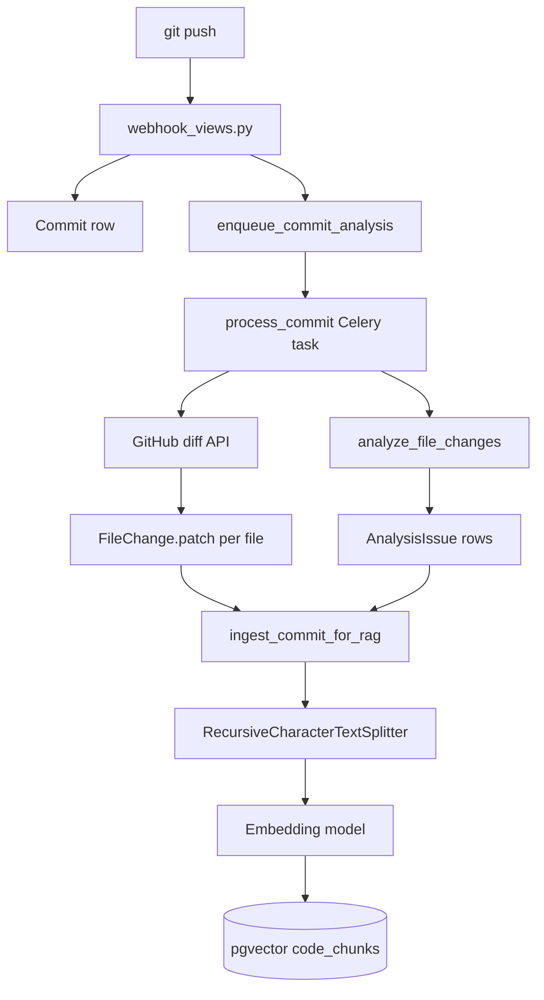
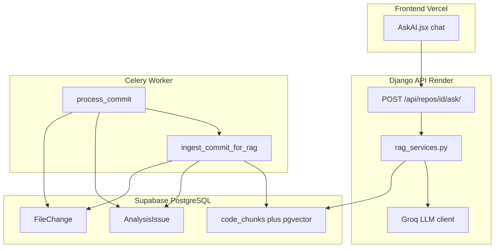

# RAG Pipeline — CommitIQ Master Guide (Hinglish)

Yeh document **poora RAG architecture** samjhata hai: kya chunk hoga, kab embed hoga, kab LLM chalega, aur kaunsi files likhenge.

> Pehle `[celery.md](celery.md)` padho (analysis pipeline), phir yeh file. RAG **Celery ke baad** lagta hai — jab `FileChange` aur `AnalysisIssue` DB mein already hain.

---

## Part 0 — Tumhara sawal: "Kya flow sahi hai?"

### Jo tumne likha (short version)

> Docs chunk → embed → pgvector → user query → embed query → closest vectors → context + prompt → LLM answer

### Verdict: **~80% sahi** — ek timing galat hai

| Tumne socha | Sach |
|-------------|------|
| Chunk + embed jab user message bhejta hai | **Nahi** — yeh **pehle se** hota hai (har commit analyze hone ke baad) |
| Query embed + search + LLM jab user message bhejta hai | **Haan** — bilkul sahi |

**Do alag phases hain:**

1. **INGEST (background)** — Celery commit analyze kare → text chunk → embed → pgvector mein save
2. **QUERY (chat)** — User question → embed → search pgvector → prompt → Groq LLM → answer

User ko wait sirf Phase 2 mein lagta hai (~1–4 sec). Chunking har message pe nahi hoti.

---

## Part 1 — "Docs" ka matlab CommitIQ mein kya hai?

### Galat idea (clear karo)

| Galat | Sahi |
|-------|------|
| `Diagrams and Concepts/` folder ki saari `.md` files chunk hongi | **Nahi** — sirf woh code jo **GitHub push** se aaya aur DB mein save hua |
| Poora repo GitHub se download karke index karenge (v1) | **Nahi abhi** — v1 mein sirf **analyzed commits** ka data |
| README, celery.md, RAG.md automatically index | Tabhi jab tum **unhe commit push** karo aur webhook + Celery ne diff save kiya |

### CommitIQ v1 mein ACTUAL sources (yeh "docs" hain hamare liye)

Hum **do cheezein** chunk + embed karte hain — dono pehle se PostgreSQL mein hain:

#### Source 1: `FileChange.patch` (commit diff)

Har commit pe har changed file ka **unified diff** text.

- **Model:** `backend/repos/models.py` → `FileChange`
- **Field:** `patch` — GitHub API se aata hai (`analysis_services.fetch_commit_diff`)
- **Example content:**

```diff
@@ -10,6 +10,9 @@ def checkout(request):
+for item in cart_items:
+    product = Product.objects.get(id=item.id)
```

Yeh **asli code change** hai jo user ne push kiya. RAG isi se jawab deta hai: *"N+1 kahan hai?"*, *"checkout mein kya badla?"*

#### Source 2: `AnalysisIssue` (static analysis findings)

Rules ne jo problem dhundi + playbook ki suggestion.

- **Model:** `AnalysisIssue` — linked to `AnalysisJob`
- **Fields:** `title`, `description`, `suggestion`, `file_path`, `line_number`, `severity`
- **Example content:**

```text
CRITICAL: N+1 query in loop
File: backend/repos/checkout/views.py line 42
Description: for item in cart_items: Product.objects.get(...)
Suggestion: Use select_related() or prefetch_related() on the queryset.
```

Yeh **pre-computed intelligence** hai. RAG ko isse questions aasaan lagte hain: *"sabse risky commit?"*, *"kya fix karun?"*

#### Har chunk ke saath metadata (alag file nahi — prefix)

Har chunk ke start mein context chipkate hain taaki LLM ko pata ho source kya hai:

```text
repository: coutKaustubh/CommitIQ
commit_sha: d8d81fb
commit_message: Suggestions list added for suggestions on error
file_path: backend/repos/analysis_services.py
source_type: diff
---
(actual patch or issue text below)
```

### v1 mein chunk NAHI hoga

| Skip | Kyun |
|------|------|
| `.env`, `*.pem`, secrets wale patches | `analysis_services` sensitive-file rule — RAG mein bhi **redact/skip** |
| Binary / images | No text |
| `patch` empty (GitHub huge file omit) | Kuch embed karne ko nahi |
| Repos jo user ne connect nahi kiye | Sirf **connected** repo + **us user** ka data |
| Poora repo tree (v2) | Baad mein optional `fetch full file` from GitHub API |

### Visual: data kahan se aata hai



---

## Part 2 — Poora architecture (CommitIQ RAG)



### Teen alag "brains" — confuse mat karo

| System | Kaam | Vector? | LLM? |
|--------|------|---------|------|
| **Rules + playbook** | N+1, large diff, sensitive file detect + fixed fix text | No | No |
| **RAG ingest** | Commit data ko searchable vectors mein badalna | Yes (store) | No |
| **RAG query + Groq** | User question ka natural language answer | Yes (search) | Yes (generate) |

Playbook **replace nahi** hota RAG se. Dono saath chalte hain.

---

## Part 3 — INGEST flow (exact logic jo likhenge)

**Trigger:** `process_commit` successfully **DONE** hone ke baad:

```python
# tasks.py — end of process_commit, after job.status = DONE
ingest_commit_for_rag.delay(commit.id)
```

### Step-by-step `ingest_commit_for_rag(commit_id)`

```
1. Load Commit + Repository (owner scope ke liye)
2. Load all FileChange rows for this commit
3. Load all AnalysisIssue rows for this commit's AnalysisJob
4. DELETE old code_chunks for this commit_id (idempotent re-ingest on retry)
5. For each FileChange:
   a. if sensitive path (.env, .pem, etc.) → SKIP
   b. if patch empty → SKIP
   c. build document string = metadata prefix + patch text
   d. chunks = recursive_chunk(document)  # chhota patch = 1 chunk
   e. embeddings = embed_texts(chunks)  # same model as query time
   f. INSERT into code_chunks (repository_id, commit_id, file_path, chunk_index, content, embedding, source_type='diff')
6. For each AnalysisIssue:
   a. build document = metadata + title + description + suggestion
   b. usually 1 chunk (short text)
   c. embed + INSERT source_type='issue'
7. Log: "ingested N chunks for commit abc1234"
```

### Recursive chunking logic

Library: `RecursiveCharacterTextSplitter` (LangChain) ya simple Python equivalent.

| Setting | Value | Kyun |
|---------|-------|------|
| `chunk_size` | ~800 characters | Groq context mein kaafi chunks fit |
| `chunk_overlap` | ~100 characters | Line context na toote boundary pe |
| Small patch &lt; 800 chars | **1 chunk** | Split zaroori nahi |

**Example:** 700-line `celery.md` commit → ~15–20 chunks, har chunk ka apna embedding vector.

### Embedding model (INGEST + QUERY dono mein SAME)

| Role | Model | Notes |
|------|-------|-------|
| **Embeddings** | HuggingFace `sentence-transformers` **ya** OpenAI `text-embedding-3-small` | Vector banata hai — pgvector mein store |
| **Generation** | **Groq** (Llama 3.x) | Sirf final answer likhta hai |

**Groq embeddings ke liye use NAHI hota.** Do alag APIs.

Vector dimension example: 384 (MiniLM) ya 1536 (OpenAI) — pgvector column usi size ka.

---

## Part 4 — QUERY flow (user chat — exact logic)

**Trigger:** User `AskAI.jsx` pe Send dabata hai.

### Frontend

```javascript
// Replace mock setTimeout with:
const res = await api(`/api/repos/${repoId}/ask/`, {
  method: 'POST',
  body: JSON.stringify({ question: userText }),
})
// res = { answer, sources: [{ file_path, commit_sha, snippet }] }
```

### Backend `POST /api/repos/{id}/ask/`

```
1. Auth: request.supabase_user → UserProfile → verify repo belongs to this user
2. Parse body: { question }
3. if question empty or too long → 400
4. q_embedding = embed_text(question)          # SAME model as ingest
5. chunks = search_similar_chunks(
       repository_id=repo.id,
       query_embedding=q_embedding,
       top_k=5,
       min_score=0.7 optional
   )
6. if chunks empty → return friendly "No indexed commits yet — push code first"
7. prompt = build_rag_prompt(chunks, question)   # template below
8. answer = groq_chat_completion(prompt)
9. return JSON { answer, sources }
```

### pgvector search SQL (concept)

```sql
SELECT id, content, file_path, commit_sha, source_type,
       1 - (embedding <=> $query_vec) AS similarity
FROM code_chunks
WHERE repository_id = $repo_id
ORDER BY embedding <=> $query_vec
LIMIT 5;
```

`<=>` = cosine distance in pgvector. Chhota distance = zyada similar.

### Pre-written prompt template (`build_rag_prompt`)

```text
You are CommitIQ, a code analysis assistant for the repository {repo_full_name}.

RULES:
- Answer ONLY using the CONTEXT below.
- If the context does not contain enough information, say "I don't have enough indexed data about that yet."
- Cite file paths and commit SHAs when mentioning code.
- Do NOT invent files, functions, or APIs not present in the context.
- Be concise and actionable.

CONTEXT:
--- Chunk 1 (file: backend/repos/views.py, commit: d8d81fb) ---
{chunk_1_content}

--- Chunk 2 (finding: CRITICAL N+1, commit: ea3df49) ---
{chunk_2_content}

...

USER QUESTION:
{question}
```

### Groq call

```python
response = groq_client.chat.completions.create(
    model="llama-3.3-70b-versatile",  # example
    messages=[{"role": "user", "content": prompt}],
    temperature=0.2,  # kam = kam hallucination
)
answer = response.choices[0].message.content
```

---

## Part 5 — Naye files / models (implementation checklist)

### Database

**Supabase SQL Editor (ek baar):**

```sql
CREATE EXTENSION IF NOT EXISTS vector;
```

**Django model `CodeChunk`:**

| Field | Type | Purpose |
|-------|------|---------|
| `repository` | FK → Repository | Scope search per repo |
| `commit` | FK → Commit | Source commit |
| `file_path` | CharField | UI source citation |
| `chunk_index` | Integer | Order within file |
| `content` | TextField | Actual text embedded |
| `embedding` | VectorField(dim=N) | pgvector |
| `source_type` | CharField | `diff` or `issue` |
| `created_at` | DateTime | Debug |

**Unique constraint:** `(commit, file_path, chunk_index, source_type)` — duplicate ingest avoid.

### Python files (naye)

| File | Responsibility |
|------|----------------|
| `backend/repos/rag_services.py` | `chunk_text()`, `embed_texts()`, `search_chunks()`, `build_rag_prompt()`, `ask_groq()` |
| `backend/repos/rag_views.py` | `ask_repo` API view |
| `backend/repos/tasks.py` | Add `ingest_commit_for_rag` task |
| `backend/repos/migrations/0007_codechunk.py` | Model + vector extension note |

### Settings (`core/settings.py`)

```python
GROQ_API_KEY = os.getenv("GROQ_API_KEY")
EMBEDDING_MODEL = os.getenv("EMBEDDING_MODEL", "sentence-transformers/all-MiniLM-L6-v2")
RAG_CHUNK_SIZE = 800
RAG_CHUNK_OVERLAP = 100
RAG_TOP_K = 5
```

### Frontend

| File | Change |
|------|--------|
| `frontend/src/pages/AskAI.jsx` | Mock hatao → real API |
| `frontend/src/api/rag.js` | `askQuestion(repoId, question)` helper |

---

## Part 6 — End-to-end timeline (ek push se answer tak)

```
T+0s    User pushes commit to GitHub
T+1s    Webhook → Commit saved → process_commit queued
T+5s    Celery: GitHub diff → FileChange rows → rules → AnalysisIssue → job DONE
T+6s    Celery: ingest_commit_for_rag → chunk → embed → pgvector rows
        (User abhi bhi chat nahi khola — indexing background mein)

--- baad mein kisi din ---

T+0s    User opens /dashboard/ask
T+1s    User types: "Where is my N+1 problem?"
T+1s    POST /ask/ → embed question → pgvector top-5 → Groq prompt
T+3s    Answer: "In checkout/views.py commit ea3df49, loop with objects.get..."
        sources: [{ file_path, commit_sha }]
```

---

## Part 7 — Example chunks (samajhne ke liye)

### Example A — chhota diff = 1 chunk

**Input FileChange.patch:**

```diff
+for x in items:
+    y = Model.objects.get(id=x)
```

**Stored chunk (1 piece):**

```text
repository: coutKaustubh/CommitIQ
commit_sha: ea3df49
file_path: backend/repos/views.py
source_type: diff
---
+for x in items:
+    y = Model.objects.get(id=x)
```

### Example B — AnalysisIssue = 1 chunk

```text
repository: coutKaustubh/CommitIQ
commit_sha: ea3df49
file_path: backend/repos/views.py
source_type: issue
severity: CRITICAL
---
Title: N+1 query pattern detected
Description: Loop body calls objects.get() per iteration.
Suggestion: Use select_related() or prefetch_related().
```

### Example C — bada markdown diff = multiple chunks

700-line `celery.md` change → splitter → chunks 0, 1, 2, ... har ek ka alag embedding.

User puche: *"How does Celery work in this project?"* → search un chunks ko uthaye jo semantic similar hain (shayad Part 1, Redis section).

---

## Part 8 — Rules vs RAG — kab kya use hota hai

| User need | System |
|-----------|--------|
| "Is this commit safe?" | Rules → risk badge on dashboard |
| "Fix for this N+1?" | Playbook on Commit Detail |
| "Which module is most fragile?" | **RAG** — multiple commits/issues compare |
| "Explain checkout regression" | **RAG** — retrieves relevant diffs + findings |
| "Write me a poem" | Out of scope — prompt guardrails |

---

## Part 9 — Verify kaise karo (implement ke baad)

1. **pgvector:** `SELECT COUNT(*) FROM code_chunks WHERE repository_id = 1;` — push ke baad &gt; 0
2. **Ingest logs:** Celery worker mein `ingested N chunks for commit ...`
3. **Ask API:** curl POST with Bearer token — answer mein real `file_path` aaye
4. **Negative test:** bina push ke repo pe pucho — "not enough indexed data" message
5. **Security:** `.env` patch wala commit — uska chunk `code_chunks` mein NA ho

---

## Part 10 — Phase 2 (baad mein, v1 ke baad)

| Feature | Description |
|---------|-------------|
| Full file fetch | GitHub API se poori file (sirf diff nahi) for files without patch |
| Cross-repo search | User ke saare connected repos |
| Chat history | Sidebar conversations DB mein |
| LLM on Commit Detail | Playbook `generic` fallback pe Groq one-liner |
| Re-rank | Retrieved chunks ko second LLM pass se sort |

---

## Quick reference — tumhara flow corrected

```
INGEST (background, har analyzed commit):
  FileChange.patch + AnalysisIssue text
  → metadata prefix
  → recursive chunk (if long)
  → embedding model
  → pgvector (code_chunks table)

QUERY (har chat message):
  user question
  → embed question
  → pgvector similarity search (top 5, same repo)
  → pre-written prompt + context
  → Groq LLM
  → answer + sources
```

Yeh **exact** flow hai jo CommitIQ mein likhenge.
