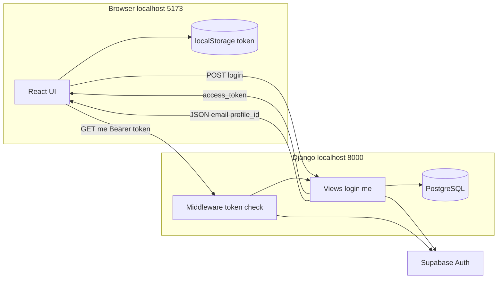

```mermaid
flowchart LR
  subgraph browser [Browser localhost 5173]
    R[React UI]
    LS[(localStorage token)]
  end

  subgraph server [Django localhost 8000]
    M[Middleware token check]
    V[Views login me]
    DB[(PostgreSQL)]
  end

  SB[Supabase Auth]

  R -->|POST login| V
  V --> SB
  V -->|access_token| R
  R --> LS
  R -->|GET me Bearer token| M
  M --> SB
  M --> V
  V --> DB
  V -->|JSON email profile_id| R
```