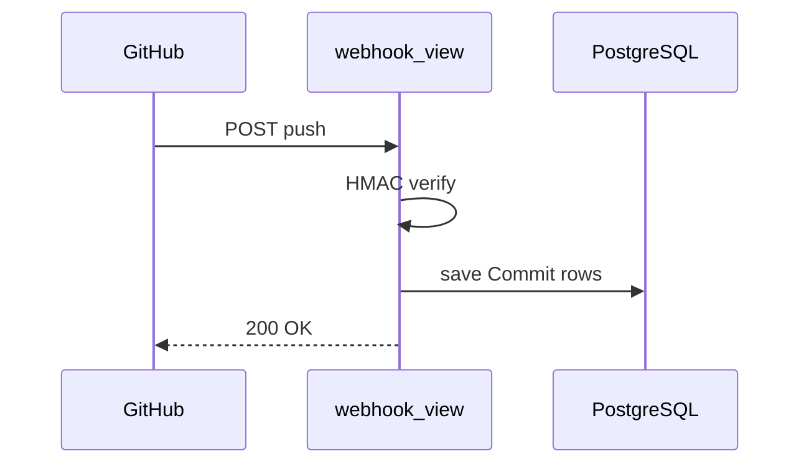
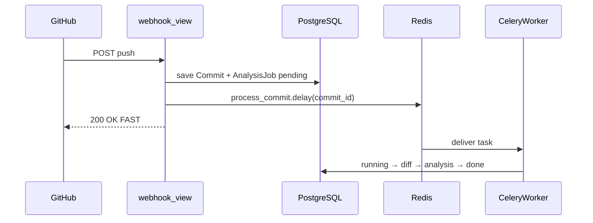
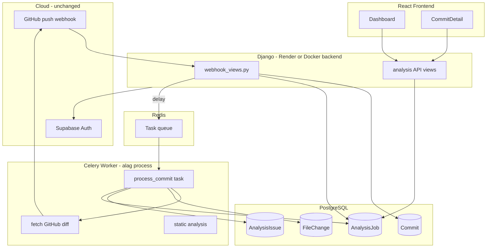
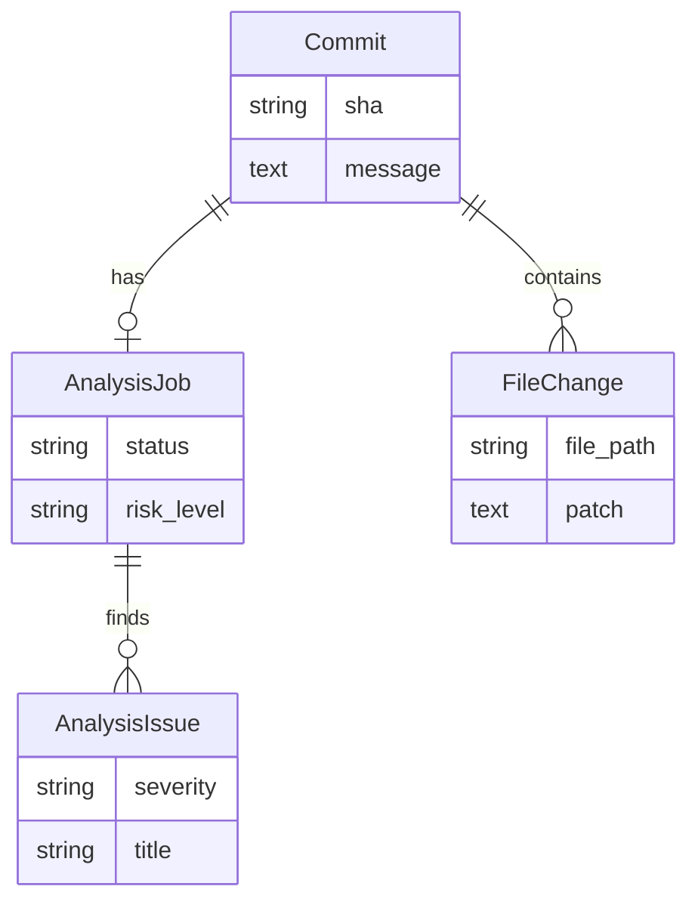

# Celery + Redis — CommitIQ Week 3 Master Guide (Hinglish)

Yeh document tumhe **teacher mode** mein samjhata hai:

- Redis aur Celery **kya hain** (aur kya **nahi** hain)
- CommitIQ mein **kyun** chahiye
- **Kaunsi files** banani hain, **kaunsi logic** likhni hai
- Week 3 ke **har din** ka kaam
- Khud **verify** kaise karo — bina sirf "AI ne kar diya" feel ke

> Pehle `[webhook.md](webhook.md)` padho (receive flow), phir `[docker.md](docker.md)` (local stack), phir yeh file.

---

## Part 0 — Tum abhi kahan ho (current codebase)

### Jo already kaam karta hai


| Flow                  | File                                                                            | Status                   |
| --------------------- | ------------------------------------------------------------------------------- | ------------------------ |
| GitHub push → webhook | `[backend/repos/webhook_views.py](../backend/repos/webhook_views.py)`           | Done                     |
| HMAC verify           | `[backend/repos/webhook_utils.py](../backend/repos/webhook_utils.py)`           | Done                     |
| Commit save DB        | `_save_commits_from_webhook_payload()`                                          | Done                     |
| Dashboard UI          | `[frontend/src/pages/Dashboard.jsx](../frontend/src/pages/Dashboard.jsx)`       | Done (analysis **mock**) |
| Commit detail UI      | `[frontend/src/pages/CommitDetail.jsx](../frontend/src/pages/CommitDetail.jsx)` | Done (analysis **mock**) |
| Mock data             | `[frontend/src/data/mock.js](../frontend/src/data/mock.js)`                     | Temporary                |


### Jo abhi NAHI hai (Week 3 banayega)

- Redis
- Celery worker
- `AnalysisJob` model
- `FileChange` model
- `process_commit` task
- Real analysis API (mock hatake)
- UI polling ("Analyzing…")

Webhook file mein already comment hai:

```text
Step F — Return 200 quickly; Celery analysis comes in Week 3.
```

---

## Part 1 — Redis kya hai? Celery kya hai?

### Galat ideas (clear karo)


| Galat                                      | Sahi                                                                                               |
| ------------------------------------------ | -------------------------------------------------------------------------------------------------- |
| "Redis sirf cache hai"                     | Redis **cache bhi ho sakta hai**, lekin hamare project mein **pehla kaam = Celery queue (broker)** |
| "Celery = line by line code run karta hai" | Celery **jobs/tasks** queue karta hai — har commit = ek job                                        |
| "Analysis webhook ke andar hi chalegi"     | **Nahi** — webhook fast 200 dega, analysis **background** mein                                     |


### Redis — CommitIQ mein role

**Redis** = fast in-memory data store. Celery setup mein:

```
Django:  "process_commit(42) chalaoc(“commit id 42 ke liye background analysis job start karo.”)"  →  message Redis queue mein daalo
Worker:  Redis se message lo  →  task chalao
```


| Redis role                                | Hamare project mein |
| ----------------------------------------- | ------------------- |
| **Broker** (task queue)                   | ✅ Main use          |
| **Result backend** (optional task status) | ✅ Use karenge       |
| **Cache** (API speedup)                   | ❌ Abhi nahi         |


**Analogy:** Redis = **order ticket rail** restaurant mein. Waiter (Django) ticket lagata hai, kitchen (Celery worker) uthata hai. Yeh fridge/cache nahi hai is flow mein.

### Celery — CommitIQ mein role

**Celery** = Python **background task system**:

- Django process **block nahi** hota
- Alag **worker process** heavy kaam karta hai
- Failed tasks **retry** ho sakte hain (Day 18)

**Analogy:** Django = reception (fast answer). Celery worker = back office (slow research).

---

## Part 2 — Problem kyun hai? (CommitIQ specific)

### Abhi webhook kya karta hai




Bas. Commit DB mein hai. **Analysis nahi.**

### Agar analysis sync webhook mein likh do (galat approach)

```
push → webhook → save commit → GitHub diff API (3s)
                              → parse files (5s)
                              → static analysis (10s+)
                              → 200 OK (TOO LATE)
```

GitHub webhook **timeout** → red X → retries → duplicate mess.

### Sahi approach (Week 3)




**Rule:** Webhook = **receive + enqueue**. Worker = **analyze**.

---

## Part 3 — Poora architecture (Week 3 end state)




---

## Part 4 — Naye database models (tumhe samajhna zaroori)

### Model 1: `AnalysisJob` (Day 14)

Har commit jiska analysis chahiye — ek job track karo.

```python
# backend/repos/models.py mein ADD hoga

class AnalysisJob(models.Model):
    class Status(models.TextChoices):
        PENDING = "pending", "Pending"
        RUNNING = "running", "Running"
        DONE = "done", "Done"
        FAILED = "failed", "Failed"

    commit = models.OneToOneField(
        "Commit",
        on_delete=models.CASCADE,
        related_name="analysis_job",
    )
    status = models.CharField(
        max_length=20,
        choices=Status.choices,
        default=Status.PENDING,
    )
    risk_level = models.CharField(
        max_length=20,
        blank=True,
        default="",
        help_text="OK, WARNING, CRITICAL — worker set karega",
    )
    error_message = models.TextField(blank=True, default="")
    created_at = models.DateTimeField(auto_now_add=True)
    started_at = models.DateTimeField(null=True, blank=True)
    finished_at = models.DateTimeField(null=True, blank=True)
```

**Kyun OneToOne?** Ek commit = ek analysis job (duplicate analysis avoid).

### Model 2: `FileChange` (Day 16)

GitHub diff se kaunsi files change hui.

```python
class FileChange(models.Model):
    commit = models.ForeignKey(
        "Commit",
        on_delete=models.CASCADE,
        related_name="file_changes",
    )
    file_path = models.CharField(max_length=512)
    status = models.CharField(max_length=20)  # added, modified, removed
    additions = models.PositiveIntegerField(default=0)
    deletions = models.PositiveIntegerField(default=0)
    patch = models.TextField(blank=True, default="")  # diff text
```

### Model 3: `AnalysisIssue` (Day 16–17)

Static analysis ka result — mock UI jaisa, lekin real DB se.

```python
class AnalysisIssue(models.Model):
    job = models.ForeignKey(
        AnalysisJob,
        on_delete=models.CASCADE,
        related_name="issues",
    )
    severity = models.CharField(max_length=20)  # OK, WARNING, CRITICAL
    title = models.CharField(max_length=255)
    file_path = models.CharField(max_length=512)
    line_number = models.PositiveIntegerField(null=True, blank=True)
    description = models.TextField(blank=True, default="")
    suggestion = models.TextField(blank=True, default="")
```

### ER diagram




---

## Part 5 — Kaunsi files banani / change karni hain (complete list)

### Nayi files (tum khud identify kar sakte ho — checklist)


| #   | File                                  | Kaam                                                 |
| --- | ------------------------------------- | ---------------------------------------------------- |
| 1   | `backend/core/celery.py`              | Celery app create + Django se link                   |
| 2   | `backend/core/__init__.py`            | Celery load on Django start                          |
| 3   | `backend/repos/tasks.py`              | `process_commit` task + helpers                      |
| 4   | `backend/repos/analysis_services.py`  | Diff fetch, static analysis logic (clean separation) |
| 5   | `backend/repos/analysis_views.py`     | Job status API, commit analysis API                  |
| 6   | `backend/repos/migrations/0005_...py` | AnalysisJob (auto generate)                          |
| 7   | `backend/repos/migrations/0006_...py` | FileChange, AnalysisIssue                            |
| 8   | `docker-compose.yml` (root)           | postgres + redis + backend + worker                  |
| 9   | `backend/Dockerfile`                  | Backend image                                        |
| 10  | `frontend/src/api/analysis.js`        | API calls for job polling                            |


### Existing files mein CHANGE


| File                                                                            | Kya change                                                      |
| ------------------------------------------------------------------------------- | --------------------------------------------------------------- |
| `[backend/core/settings.py](../backend/core/settings.py)`                       | `CELERY_BROKER_URL`, `CELERY_RESULT_BACKEND`, `CELERY_*` config |
| `[backend/requirements.txt](../backend/requirements.txt)`                       | `celery`, `redis` add                                           |
| `[backend/repos/webhook_views.py](../backend/repos/webhook_views.py)`           | Save ke baad `process_commit.delay()`                           |
| `[backend/repos/urls.py](../backend/repos/urls.py)`                             | Analysis endpoints add                                          |
| `[backend/repos/admin.py](../backend/repos/admin.py)`                           | Naye models register                                            |
| `[frontend/src/pages/CommitDetail.jsx](../frontend/src/pages/CommitDetail.jsx)` | Mock hatake poll API                                            |
| `[frontend/src/pages/Dashboard.jsx](../frontend/src/pages/Dashboard.jsx)`       | Real feed API                                                   |
| `[frontend/src/data/mock.js](../frontend/src/data/mock.js)`                     | Eventually delete / shrink                                      |


---

## Part 6 — Setup step-by-step (logic samajh ke)

### Step A — Redis + Celery config (`settings.py`)

```python
# Ye env vars Docker Compose ya .env se aayenge
CELERY_BROKER_URL = os.getenv("CELERY_BROKER_URL", "redis://127.0.0.1:6379/0")
CELERY_RESULT_BACKEND = os.getenv("CELERY_RESULT_BACKEND", "redis://127.0.0.1:6379/0")
CELERY_ACCEPT_CONTENT = ["json"]
CELERY_TASK_SERIALIZER = "json"
CELERY_RESULT_SERIALIZER = "json"
CELERY_TIMEZONE = "UTC"
```

**Tumhe yaad rakhna:** Local Docker mein host `redis` hai, `localhost` nahi.

### Step B — `backend/core/celery.py`

```python
import os
from celery import Celery

os.environ.setdefault("DJANGO_SETTINGS_MODULE", "core.settings")

app = Celery("commitiq")
app.config_from_object("django.conf:settings", namespace="CELERY")
app.autodiscover_tasks()  # har app ke tasks.py dhundhega
```

### Step C — `backend/core/__init__.py`

```python
from .celery import app as celery_app

__all__ = ("celery_app",)
```

**Kyun?** Django start hote hi Celery app load ho — worker same code use kare.

### Step D — `backend/repos/tasks.py` (dil / heart)

Day 14 (stub):

```python
from celery import shared_task
from django.utils import timezone
from .models import AnalysisJob, Commit

@shared_task
def process_commit(commit_id):
    job = AnalysisJob.objects.select_related("commit").get(commit__id=commit_id)
    job.status = AnalysisJob.Status.RUNNING
    job.started_at = timezone.now()
    job.save(update_fields=["status", "started_at"])

    # Day 14: sirf fake success — queue test
    job.status = AnalysisJob.Status.DONE
    job.risk_level = "OK"
    job.finished_at = timezone.now()
    job.save(update_fields=["status", "risk_level", "finished_at"])
```

Day 16+ (real):

```python
@shared_task(bind=True, max_retries=3, default_retry_delay=60)
def process_commit(self, commit_id):
    # 1. job → RUNNING
    # 2. commit + repo + owner token nikalo
    # 3. GitHub diff API call (analysis_services.fetch_diff)
    # 4. FileChange rows save
    # 5. static analysis (analysis_services.analyze_diff)
    # 6. AnalysisIssue rows save
    # 7. job.risk_level compute
    # 8. job → DONE
    # except: job → FAILED, self.retry(...)
```

### Step E — Webhook change (Day 15)

Abhi `[webhook_views.py](../backend/repos/webhook_views.py)` line ~167 pe sirf save hota hai.

**Tumhe yahan logic add karni hai** — `_save_commits_from_webhook_payload` ko thoda refactor:

```python
# OPTION: save function commit objects return kare, sirf count nahi

saved_commits = []
for item in commits_payload:
    commit, _ = Commit.objects.update_or_create(...)
    saved_commits.append(commit)

for commit in saved_commits:
    job, _ = AnalysisJob.objects.get_or_create(
        commit=commit,
        defaults={"status": AnalysisJob.Status.PENDING},
    )
    if job.status in (AnalysisJob.Status.PENDING, AnalysisJob.Status.FAILED):
        from .tasks import process_commit
        process_commit.delay(commit.id)

return JsonResponse({"ok": True, "saved": len(saved_commits), ...})
```

**Important rules:**

- `delay()` ke baad turant `return` — koi heavy code mat likho
- Duplicate webhook delivery pe `get_or_create` + status check — dobara queue spam na ho
- GitHub ko hamesha **200** (connected repo pe)

---

## Part 7 — Worker ke andar kya hoga (Day 16 logic detail)

### 7.1 GitHub diff fetch

File: `backend/repos/analysis_services.py`

```python
def fetch_commit_diff(token, full_name, sha):
    """
    GET /repos/{owner}/{repo}/commits/{sha}
    Response mein files[] array — har file ka patch/filename/status
    """
    # github_client.github_request use karo — already project mein hai
```

Tumhara existing `[github_client.py](../backend/repos/github_client.py)`:

```python
github_request("GET", f"/repos/{full_name}/commits/{sha}", token)
```

Token kahan se? `commit.repository.owner.github_access_token`

### 7.2 FileChange save

```python
for file in diff_files:
    FileChange.objects.update_or_create(
        commit=commit,
        file_path=file["filename"],
        defaults={
            "status": file["status"],
            "additions": file.get("additions", 0),
            "deletions": file.get("deletions", 0),
            "patch": file.get("patch", "") or "",
        },
    )
```

### 7.3 Static analysis (Week 3 MVP — simple rules)

Pehle fancy AI nahi — **rule-based** start (seekhne ke liye best):


| Rule           | Example detect                                        |
| -------------- | ----------------------------------------------------- |
| N+1 pattern    | `for` loop + `.get(` in Python patch                  |
| Large change   | additions + deletions > 500 lines → WARNING           |
| Sensitive file | `settings.py`, `.env`, `middleware` changed → WARNING |


```python
def analyze_patches(file_changes):
    issues = []
    for fc in file_changes:
        if "for " in fc.patch and ".get(" in fc.patch:
            issues.append({
                "severity": "CRITICAL",
                "title": "Possible N+1 Query",
                "file_path": fc.file_path,
                ...
            })
    return issues
```

Baad mein AST parser / LLM add kar sakte ho — pehle pipeline stable karo.

### 7.4 Risk level compute

```python
def compute_risk(issues):
    if any(i["severity"] == "CRITICAL" for i in issues):
        return "CRITICAL"
    if any(i["severity"] == "WARNING" for i in issues):
        return "WARNING"
    return "OK"
```

Yeh wahi hai jo abhi `[frontend/src/data/mock.js](../frontend/src/data/mock.js)` fake karta hai.

---

## Part 8 — API + Frontend (Day 17)

### Naye endpoints


| Method | Path                                 | Response                                |
| ------ | ------------------------------------ | --------------------------------------- |
| `GET`  | `/api/repos/analysis/jobs/{job_id}/` | `{ status, risk_level, error_message }` |
| `GET`  | `/api/repos/commits/{sha}/analysis/` | job + issues + file_changes             |


JWT required — normal middleware.

### Frontend polling pattern

Commit detail page pe:

```javascript
// Pseudocode — CommitDetail.jsx
useEffect(() => {
  if (!analysis || analysis.status === 'done' || analysis.status === 'failed') return

  const interval = setInterval(async () => {
    const data = await api(`/api/repos/analysis/jobs/${jobId}/`)
    setAnalysis(data)
  }, 2000)  // har 2 sec

  return () => clearInterval(interval)
}, [jobId, analysis?.status])
```

UI states:


| status    | UI dikhao                |
| --------- | ------------------------ |
| `pending` | "Queued for analysis…"   |
| `running` | Skeleton / spinner       |
| `done`    | Real issues + risk badge |
| `failed`  | Error + "Retry" button   |


Retry button → `POST /api/repos/analysis/retry/` → dubara `process_commit.delay()`

---

## Part 9 — Week 3 schedule → exact kaam


| Day    | Date   | Tum kya karoge                                     | Verify kaise                                 |
| ------ | ------ | -------------------------------------------------- | -------------------------------------------- |
| **14** | 15 Jun | Docker + Celery config + `AnalysisJob` + stub task | `delay()` shell se → worker log + job `done` |
| **15** | 16 Jun | Webhook → enqueue                                  | git push → job `pending` → worker → `done`   |
| **16** | 17 Jun | Diff + `FileChange` + basic analysis               | DB mein file_changes rows                    |
| **17** | 18 Jun | Analysis API + UI poll                             | UI mock hatake real data                     |
| **18** | 19 Jun | Retry + failed states                              | GitHub API fail simulate → retry             |
| **19** | 20 Jun | Prod worker + Redis (Upstash/Railway)              | Render pe push → full E2E                    |


---

## Part 10 — Local run commands (yaad rakhna)

```bash
# Terminal 1 — poora backend stack
docker compose up --build

# Terminal 2 — frontend (host pe)
cd frontend && npm run dev

# Migrations
docker compose exec backend python manage.py migrate

# Worker logs dekho
docker compose logs -f celery_worker

# Manual task test
docker compose exec backend python manage.py shell
>>> from repos.tasks import process_commit
>>> from repos.models import Commit
>>> c = Commit.objects.first()
>>> process_commit.delay(c.id)
```

---

## Part 11 — Production (Day 19) — Docker jaisa logic, cloud pe


| Local Docker              | Production                             |
| ------------------------- | -------------------------------------- |
| `redis` container         | Upstash Redis / Render Redis URL       |
| `celery_worker` container | Railway / Render **Background Worker** |
| `backend` container       | Render web (already live)              |
| `db` container            | Render Postgres                        |


Env same:

```
CELERY_BROKER_URL=rediss://...upstash...
CELERY_RESULT_BACKEND=rediss://...upstash...
```

Worker command:

```bash
celery -A core worker -l info --concurrency=2
```

---

## Part 12 — Redis vs PostgreSQL — data kahan jayega


| Data                       | Store                      |
| -------------------------- | -------------------------- |
| Commit metadata            | PostgreSQL `Commit`        |
| Job status, risk           | PostgreSQL `AnalysisJob`   |
| File diffs                 | PostgreSQL `FileChange`    |
| Issues found               | PostgreSQL `AnalysisIssue` |
| "Task abhi queue mein hai" | Redis (temporary message)  |


**Redis permanent analysis store nahi hai.** PostgreSQL = source of truth.

---

## Part 13 — Self-learning checkpoints (teacher homework)

Har day ke baad bina AI ke likho (5 lines):

### Template

```text
1. Aaj ka goal kya tha?
2. Kaunsi file banayi / change ki?
3. Data flow ek line mein?
4. Ek cheez jo break ho sakti hai?
5. Kal kya add hoga?
```

### Day 14 checkpoint questions (khud answer do)

1. `process_commit.delay(5)` call karne pe Redis mein kya hota hai?
2. Worker band ho to Django API chalega ya nahi?
3. `AnalysisJob.status` kab `pending` se `running` hota hai?
4. Webhook abhi task queue karta hai ya nahi? (Day 14 ke end pe)

Agar 4/4 answer aa gaye — tum seekh rahe ho, sirf copy nahi.

---

## Part 14 — Cursor / AI ke saath sahi tarah kaam (is project ke liye)

### Galat pattern (avoid)

```text
"Tum poora Week 3 implement kar do"
→ tum dekho working hai
→ kuch yaad nahi
```

### Sahi pattern (use karo)

**Session 1 — samjho:**

> "celery.md Day 14 padh liya. Pehle explain karo `core/celery.py` kyun chahiye. Code mat likho."

**Session 2 — khud likho:**

> "Maine `AnalysisJob` model likha — review karo, mistakes batao."

**Session 3 — debug:**

> "Worker task utha nahi raha. Maine redis URL yeh rakha hai. Hint do, full fix mat do."

**Session 4 — implement small:**

> "Sirf webhook mein enqueue logic add karo — baaki mat chhedo."

---

## Part 15 — Mock se real tak (frontend)


| Abhi (mock)                 | Week 3 ke baad (real)                     |
| --------------------------- | ----------------------------------------- |
| `MOCK_ANALYSIS_FEED`        | `GET /api/repos/commits/recent-analysis/` |
| `MOCK_COMMIT_DETAIL.static` | `GET /api/repos/commits/{sha}/analysis/`  |
| Hardcoded risk badges       | `AnalysisJob.risk_level`                  |
| Instant load                | Poll while `status !== done`              |


`[frontend/src/data/mock.js](../frontend/src/data/mock.js)` delete tab karna jab API stable ho.

---

## Part 16 — Common bugs (pehle se jaano)


| Bug                           | Cause                        | Fix                                  |
| ----------------------------- | ---------------------------- | ------------------------------------ |
| Task queue hota hai, run nahi | Worker chal nahi raha        | `docker compose ps`, worker logs     |
| `Connection refused redis`    | Galat URL                    | Docker mein `redis://redis:6379/0`   |
| Duplicate jobs har push pe    | Har save pe blind `delay()`  | Status check + `get_or_create`       |
| GitHub webhook red            | Sync analysis webhook mein   | Sirf enqueue, heavy worker mein      |
| UI hamesha mock               | API wire nahi ki             | CommitDetail poll add karo           |
| `github token missing`        | Email login, no GitHub OAuth | GitHub sign-in required for diff API |


---

## Part 17 — Ek page cheat sheet

```text
REDIS    = task ki line (queue) — "commit 42 analyze karo" message
CELERY   = background worker — message utha ke kaam karta hai
WEBHOOK  = fast save + enqueue — analysis NAHI
WORKER   = diff + analysis + DB update
AnalysisJob = job ki state machine (pending→running→done/failed)
FileChange  = GitHub diff ki files
AnalysisIssue = N+1, warnings, etc.
PostgreSQL = sab permanent data
mock.js  = temporary — Week 3 ke end pe hatao
```

---

## Part 18 — Implementation order (copy on wall)

```
1. requirements: celery, redis
2. settings: CELERY_BROKER_URL
3. core/celery.py + __init__.py
4. AnalysisJob model + migrate
5. tasks.py stub process_commit
6. docker-compose: redis + worker
7. TEST: delay() manually
8. webhook: enqueue after save
9. TEST: git push → job runs
10. FileChange + diff fetch
11. AnalysisIssue + rules
12. analysis API
13. frontend poll
14. retry + failed UI
15. prod worker
```

**Ek step verify, phir next.** Jump mat karo.

---

## Related docs

- `[webhook.md](webhook.md)` — webhook receive logic (already done)
- `[docker.md](docker.md)` — Redis + worker containers locally
- `[production.md](production.md)` — Render/Vercel deploy
- `[README.md](../README.md)` — project overview

---

*CommitIQ Week 3 — Celery + Redis. Webhook fast rakho, analysis background mein. Mock hatake real banao.*