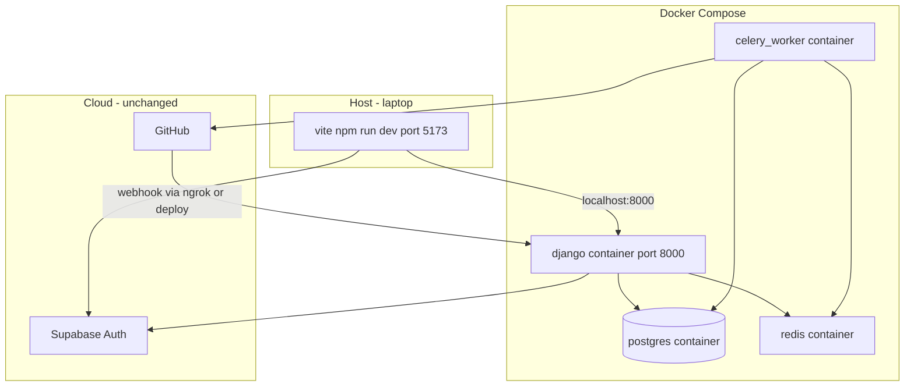

# Docker — General + CommitIQ Project (Hinglish Guide)

Yeh document samjhata hai: **Docker kya hai**, **kyun chahiye**, **CommitIQ mein kya karenge**, **files ka format**, aur **kaise chalate hain**.

---

## Part 1 — Problem pehle, solution baad mein

### Bina Docker ke kya hota hai?

Tumhare laptop pe CommitIQ chalane ke liye manually ye sab karna padta hai:

1. PostgreSQL install karo (version 16? 15? koi aur?)
2. Python 3.12 venv banao
3. `pip install -r requirements.txt`
4. Redis install karo (Week 3 se Celery ke liye)
5. `python manage.py migrate`
6. `python manage.py runserver`
7. Alag terminal: `celery -A core worker`
8. Alag terminal: `cd frontend && npm run dev`

**Dusre developer** ya **dusri machine** pe:

- "Mere pe to chal raha hai" vs "Mere pe Redis nahi mil raha"
- Windows vs Mac vs Linux — commands alag
- Postgres port conflict, Python version galat, env vars bhool gaye

Yeh problem industry mein **"works on my machine"** kehlati hai.

### Docker ka core idea

> **Application ko uske saare dependencies ke saath ek standardized "box" mein pack karo — jo har machine pe same tarah chale.**

Us box ko **container** kehte hain. Box banane ka recipe **image** hota hai.

---

## Part 2 — Docker kya hai? (Technical + Simple)

### Simple analogy (dhaba wala)


| Real world                                 | Docker world                     |
| ------------------------------------------ | -------------------------------- |
| Dhaba ka **recipe** (ingredients + steps)  | **Dockerfile**                   |
| Recipe se banaya hua **ready meal packet** | **Image**                        |
| Packet khol ke garam karke **khana**       | **Container** (running instance) |
| Fridge mein rakha hua packet               | Image (stored, not running)      |


- **Image** = read-only template (frozen snapshot)
- **Container** = image ka running instance (alive process)
- Ek image se **multiple containers** chala sakte ho (usually alag services ke liye alag images/containe rs)

### Technical definition

**Docker** ek **container platform** hai jo:

1. **OS-level virtualization** use karta hai (full VM jitna heavy nahi)
2. Linux **namespaces** + **cgroups** se process ko isolate karta hai
3. Har container ko lagta hai uska apna filesystem / network hai
4. Host machine ka kernel share hota hai — isliye VM se **fast** aur **light**

```
┌─────────────────────────────────────────────┐
│  Tumhara Laptop (Windows/Mac/Linux)         │
│  ┌───────────────────────────────────────┐  │
│  │  Docker Engine (Docker Desktop)       │  │
│  │  ┌─────────┐ ┌─────────┐ ┌─────────┐  │  │
│  │  │Container│ │Container│ │Container│  │  │
│  │  │ Django  │ │ Redis   │ │ Celery  │  │  │
│  │  └─────────┘ └─────────┘ └─────────┘  │  │
│  │  ┌─────────┐                          │  │
│  │  │Container│                          │  │
│  │  │ Postgres│                          │  │
│  │  └─────────┘                          │  │
│  └───────────────────────────────────────┘  │
└─────────────────────────────────────────────┘
```

---

## Part 3 — Docker vs Virtual Machine (VM)


|                    | Virtual Machine                      | Docker Container       |
| ------------------ | ------------------------------------ | ---------------------- |
| **Kya chalta hai** | Poora guest OS (Windows in VM, etc.) | Sirf app + libraries   |
| **Size**           | GBs                                  | MBs se start           |
| **Start time**     | Minutes                              | Seconds                |
| **Use case**       | Different OS chahiye                 | Same OS, isolated apps |
| **CommitIQ**       | Overkill local dev ke liye           | Perfect                |


Docker **VM replace nahi karta** jab tumhe literally Windows app Linux pe chalani ho — lekin **web dev stack** (Postgres + Redis + Django) ke liye ideal hai.

---

## Part 4 — Kyun Docker **generally** chahiye?

### 1. Consistency (sabse bada reason)

```bash
docker compose up
```

→ Har developer ko **same Postgres version**, **same Redis**, **same Python env** — bina manual install.

### 2. Isolation

- Tumhare laptop pe jo Postgres port 5432 pe chal raha hai, wo Docker wale se **conflict** nahi karega (agar ports map sahi ho)
- Project A ka Redis project B se alag container

### 3. Reproducible builds

- `Dockerfile` = code jaisa recipe — git mein commit, review, version control
- CI/CD: "build image → test → deploy same image"

### 4. Onboarding fast

Naya banda:

```bash
git clone ...
cp .env.example .env
docker compose up
```

— hours ki setup → minutes

### 5. Production similarity

Local mein bhi **multi-service** stack (API + worker + Redis) waise hi feel hota hai jaise production mein alag processes hote hain.

### 6. Cleanup easy

```bash
docker compose down -v
```

→ Poora stack + data volumes hat gaye — laptop pe kachra nahi.

---

## Part 5 — Kyun Docker **CommitIQ project** mein chahiye?

### Hamara stack Week 3 se aur complex ho gaya


| Service           | Kaam                     | Pehle                 | Week 3+                   |
| ----------------- | ------------------------ | --------------------- | ------------------------- |
| **PostgreSQL**    | Users, repos, commits    | Local install / cloud | Same                      |
| **Django**        | REST API + webhooks      | `runserver`           | Same                      |
| **Redis**         | Celery message queue     | **Nahi tha**          | **Chahiye**               |
| **Celery worker** | Background analysis jobs | **Nahi tha**          | **Chahiye**               |
| **React**         | Frontend                 | `npm run dev`         | Host pe (Docker optional) |


**Celery bina Redis ke nahi chalta** — Redis ek alag process hai. Docker Compose se **ek command** mein:

```
postgres + redis + django + celery worker
```

sab uth jata hai.

### Webhook + Celery flow (kyun isolate processes matter karte hain)

```
GitHub push
    → POST /api/webhooks/github/  (Django — FAST 200 return)
    → commit DB mein save
    → process_commit.delay()  → Redis queue
    → Celery worker (alag process) → diff fetch, analysis, AnalysisJob update
```

Agar analysis **webhook request ke andar** sync chalao:

- GitHub 10+ second wait karega
- Timeout / red X on webhook
- GitHub retries → duplicate work

Isliye **worker alag process** — Docker mein **alag container** natural fit hai.

### CommitIQ mein Docker kya solve karta hai (specific)


| Problem                                        | Docker solution                                  |
| ---------------------------------------------- | ------------------------------------------------ |
| "Redis install kaise karein Windows pe?"       | `redis` service in compose — image pull, done    |
| "Celery worker bhool gaye start karna"         | `celery_worker` service auto-starts with compose |
| "Postgres version team mein alag"              | Fixed `postgres:16` image                        |
| "DATABASE_URL localhost vs docker hostname"    | Compose network: host `db` not `localhost`       |
| Week 3 schedule: Docker + Celery + AnalysisJob | Ek `docker-compose.yml` se poora backend stack   |


### CommitIQ mein Docker kya **NAHI** replace karta


| Cheez            | Kahan rehti hai                                            |
| ---------------- | ---------------------------------------------------------- |
| **Supabase**     | Cloud — auth OAuth                                         |
| **GitHub**       | Cloud — API + webhooks                                     |
| **Vercel**       | Production frontend                                        |
| **Render**       | Production Django API (abhi)                               |
| **Frontend dev** | Tumne choose kiya: `npm run dev` host pe (Docker optional) |


Production pe Day 19 tak: **Render web service** + **alag worker** + **Upstash/Render Redis** — same architecture, hosted services instead of local containers.

---

## Part 6 — CommitIQ mein Docker se kya karenge? (Architecture)

### Local development (target)




### Containers breakdown


| Container name  | Image / build              | Command                  | Port          |
| --------------- | -------------------------- | ------------------------ | ------------- |
| `db`            | `postgres:16`              | default                  | 5432 internal |
| `redis`         | `redis:7-alpine`           | default                  | 6379 internal |
| `backend`       | build `backend/Dockerfile` | `runserver 0.0.0.0:8000` | **8000:8000** |
| `celery_worker` | same as backend            | `celery -A core worker`  | none          |


**Frontend** — Docker ke **bahar**: `cd frontend && npm run dev`

---

## Part 7 — Docker ki main files — format samjho

Docker project mein usually **2 types** ki files hoti hain:

### File 1: `Dockerfile` (singular — ek service ka recipe)

**Location:** usually `backend/Dockerfile`

**Purpose:** Image kaise **build** hogi — OS base, dependencies, code copy, default command.

**General format:**

```dockerfile
# Step 1: Base image (starting point)
FROM python:3.12-slim

# Step 2: Working directory container ke andar
WORKDIR /app

# Step 3: Environment variables (optional)
ENV PYTHONDONTWRITEBYTECODE=1
ENV PYTHONUNBUFFERED=1

# Step 4: System dependencies (agar chahiye — e.g. psycopg2 ke liye)
RUN apt-get update && apt-get install -y --no-install-recommends \
    libpq-dev gcc \
    && rm -rf /var/lib/apt/lists/*

# Step 5: Python dependencies pehle (cache layer — smart builds)
COPY requirements.txt .
RUN pip install --no-cache-dir -r requirements.txt

# Step 6: Application code copy
COPY . .

# Step 7: Default command jab container start ho (compose override kar sakta hai)
CMD ["python", "manage.py", "runserver", "0.0.0.0:8000"]
```

**Har line `FROM`, `RUN`, `COPY`, `CMD` ek "layer" banati hai** — Docker cache karta hai, rebuild fast.

**Important instructions:**


| Instruction | Matlab                                                                      |
| ----------- | --------------------------------------------------------------------------- |
| `FROM`      | Base image — kahan se shuru                                                 |
| `WORKDIR`   | `cd` jaisa — andar ka path                                                  |
| `COPY`      | Host se container mein files                                                |
| `RUN`       | Build time pe command (install, compile)                                    |
| `CMD`       | Container **start** pe default command                                      |
| `EXPOSE`    | Documentation — ye port use hota hai (actually publish `compose` karta hai) |
| `ENV`       | Environment variable image ke andar                                         |


---

### File 2: `docker-compose.yml` (multi-container orchestra)

**Location:** repo root `docker-compose.yml`

**Purpose:** **Kaunse containers** chalenge, **kaise connect** honge, **ports**, **env**, **volumes**.

**General format:**

```yaml
services:
  # Service 1: Database
  db:
    image: postgres:16
    environment:
      POSTGRES_DB: commitiq
      POSTGRES_USER: commitiq
      POSTGRES_PASSWORD: commitiq
    volumes:
      - postgres_data:/var/lib/postgresql/data
    healthcheck:
      test: ["CMD-SHELL", "pg_isready -U commitiq"]
      interval: 5s
      timeout: 5s
      retries: 5

  # Service 2: Redis (Celery broker)
  redis:
    image: redis:7-alpine
    healthcheck:
      test: ["CMD", "redis-cli", "ping"]
      interval: 5s

  # Service 3: Django API
  backend:
    build:
      context: ./backend
      dockerfile: Dockerfile
    command: python manage.py runserver 0.0.0.0:8000
    ports:
      - "8000:8000"
    env_file:
      - ./backend/.env
    environment:
      # Override: container ke andar hostname "db" hai, "localhost" nahi
      DATABASE_URL: postgresql://commitiq:commitiq@db:5432/commitiq
      CELERY_BROKER_URL: redis://redis:6379/0
      CELERY_RESULT_BACKEND: redis://redis:6379/0
    depends_on:
      db:
        condition: service_healthy
      redis:
        condition: service_healthy
    volumes:
      - ./backend:/app
    # Optional: code change pe auto reload dev ke liye

  # Service 4: Celery worker (SAME image, DIFFERENT command)
  celery_worker:
    build:
      context: ./backend
      dockerfile: Dockerfile
    command: celery -A core worker -l info
    env_file:
      - ./backend/.env
    environment:
      DATABASE_URL: postgresql://commitiq:commitiq@db:5432/commitiq
      CELERY_BROKER_URL: redis://redis:6379/0
      CELERY_RESULT_BACKEND: redis://redis:6379/0
    depends_on:
      db:
        condition: service_healthy
      redis:
        condition: service_healthy
    volumes:
      - ./backend:/app

volumes:
  postgres_data:
```

**Key concepts in compose:**


| Key                        | Matlab                                                          |
| -------------------------- | --------------------------------------------------------------- |
| `services`                 | Har entry = ek container                                        |
| `image`                    | Pull ready-made image (postgres, redis)                         |
| `build`                    | Dockerfile se build karo (django, worker)                       |
| `ports`                    | `"host:container"` — `8000:8000` = laptop:8000 → container:8000 |
| `environment` / `env_file` | Env vars                                                        |
| `depends_on`               | Start order — db/redis pehle                                    |
| `volumes`                  | Data persist / code mount                                       |
| `command`                  | Dockerfile `CMD` override                                       |


### `localhost` vs Docker service names

**Bahut important CommitIQ ke liye:**


| Connection              | Galat (container ke andar) | Sahi                           |
| ----------------------- | -------------------------- | ------------------------------ |
| Django → Postgres       | `localhost:5432`           | `db:5432`                      |
| Django → Redis          | `localhost:6379`           | `redis:6379`                   |
| Laptop browser → Django | `localhost:8000`           | `localhost:8000` (port mapped) |


Compose apni **internal network** banata hai — service name = hostname.

---

## Part 8 — Docker install + run steps (practical)

### Step 0: Install Docker Desktop

1. Download: [https://www.docker.com/products/docker-desktop/](https://www.docker.com/products/docker-desktop/)
2. Windows: WSL2 enable (installer guide follow karo)
3. Install → restart
4. Verify:

```bash
docker --version
docker compose version
```

### Step 1: Project mein files ready (Week 3 Day 14 — abhi implement hoga)

```
CommitIQ/
├── docker-compose.yml
└── backend/
    └── Dockerfile
```

### Step 2: Environment file

```bash
cp backend/.env.example backend/.env
# Supabase keys, SECRET_KEY, GITHUB_WEBHOOK_SECRET bharo
# DATABASE_URL compose override karega — local .env mein bhi sahi rakho
```

### Step 3: Pehli baar build + start

```bash
# Repo root se
docker compose up --build
```

- `--build` = images fresh build
- Pehli baar: postgres + redis pull, django image build — time lagega

### Step 4: Migrations (pehli baar ya model change pe)

Alag terminal:

```bash
docker compose exec backend python manage.py migrate
docker compose exec backend python manage.py createsuperuser
```

### Step 5: Frontend (host pe)

```bash
cd frontend
npm run dev
```

Browser: `http://localhost:5173`  
API: `http://localhost:8000`

### Step 6: Celery verify

```bash
docker compose logs -f celery_worker
```

Django shell se test (baad mein):

```bash
docker compose exec backend python manage.py shell
>>> from repos.tasks import process_commit
>>> process_commit.delay(1)
```

Worker logs mein task dikhna chahiye.

### Step 7: Band karna

```bash
# Containers stop (data volume rehta hai)
docker compose down

# Sab + volumes delete (fresh DB)
docker compose down -v
```

---

## Part 9 — Useful Docker commands (cheat sheet)

### Compose (roz ka kaam)


| Command                                                | Kaam                                  |
| ------------------------------------------------------ | ------------------------------------- |
| `docker compose up`                                    | Start (foreground — logs dikhte hain) |
| `docker compose up -d`                                 | Start **detached** (background)       |
| `docker compose up --build`                            | Rebuild images + start                |
| `docker compose down`                                  | Stop + remove containers              |
| `docker compose down -v`                               | Stop + **volumes delete**             |
| `docker compose ps`                                    | Kaunse containers chal rahe           |
| `docker compose logs backend`                          | Sirf django logs                      |
| `docker compose logs -f celery_worker`                 | Worker logs follow                    |
| `docker compose exec backend bash`                     | Container ke andar shell              |
| `docker compose exec backend python manage.py migrate` | Migrate inside container              |
| `docker compose restart celery_worker`                 | Sirf worker restart                   |


### Images & cleanup


| Command               | Kaam                           |
| --------------------- | ------------------------------ |
| `docker images`       | Local images list              |
| `docker ps`           | Running containers             |
| `docker ps -a`        | Saare containers (stopped bhi) |
| `docker system prune` | Unused stuff clean (careful)   |


---

## Part 10 — Volumes, networks, bind mounts (thoda deep)

### Named volume (`postgres_data`)

```yaml
volumes:
  - postgres_data:/var/lib/postgresql/data
```

- Data **container delete** hone pe bhi bachta hai
- `docker compose down -v` pe delete hota hai

### Bind mount (dev code sync)

```yaml
volumes:
  - ./backend:/app
```

- Laptop ki `backend/` folder container ke `/app` se linked
- Code edit → container mein turant reflect (runserver reload)
- **Production image mein usually nahi** — code image ke andar baked

### Network

Compose automatically banata hai: `commitiq_default` (project name se)

- `backend` → `redis:6379` resolve hota hai internally
- Host se sirf **published ports** (`8000:8000`) accessible

---

## Part 11 — `.dockerignore` (Dockerfile ke saath)

`backend/.dockerignore` — build mein ye files **copy mat karo**:

```
venv/
__pycache__/
*.pyc
.env
staticfiles/
.git/
```

- Image chhoti, build fast
- Secrets accidentally image mein na jayein

---

## Part 12 — Local Docker vs Production (CommitIQ)


|               | Local Docker Compose      | Production (abhi)               |
| ------------- | ------------------------- | ------------------------------- |
| Django        | `backend` container       | Render web service              |
| Postgres      | `db` container            | Render Postgres                 |
| Redis         | `redis` container         | Upstash / Render Redis (Day 19) |
| Celery        | `celery_worker` container | Railway/Render worker (Day 19)  |
| Frontend      | Host `npm run dev`        | Vercel                          |
| Webhooks test | ngrok → localhost:8000    | Render URL                      |


**Same mental model** — alag processes — bas production pe managed services.

---

## Part 13 — Common problems + fixes

### Port already in use

```
Error: bind 0.0.0.0:8000 failed
```

→ Laptop pe pehle se `runserver` chal raha hai. Band karo ya compose mein `"8001:8000"`.

### `connection refused` to database

→ `DATABASE_URL` mein `localhost` ki jagah `db` use karo (compose ke andar).

### Celery worker tasks nahi utha raha

→ Redis URL check: `redis://redis:6379/0`  
→ Worker container running? `docker compose ps`  
→ `depends_on` + healthcheck — db/redis ready hone ke baad start

### Windows line endings

→ Git `core.autocrlf` issues — kabhi kabhi shell scripts fail. `LF` prefer karo.

### Docker Desktop not running

→ "Cannot connect to Docker daemon" — Docker Desktop start karo.

### Webhook local test

→ GitHub container `backend` ko directly nahi dekhta — **ngrok** chahiye:

```bash
ngrok http 8000
```

→ `PUBLIC_API_URL` ngrok URL (temporary)

---

## Part 14 — Week 3 schedule mapping


| Day    | Docker/Celery kaam                                                          |
| ------ | --------------------------------------------------------------------------- |
| **14** | `docker-compose.yml`, `Dockerfile`, Celery app, `AnalysisJob` model         |
| **15** | Webhook → `process_commit.delay()`                                          |
| **16** | Worker mein diff fetch → `FileChange`                                       |
| **17** | Job status API + UI poll                                                    |
| **18** | Retry + failed states                                                       |
| **19** | Production worker + Redis (Render/Railway) — Docker nahi, same architecture |


---

## Part 15 — Ek line summaries


| Sawal                     | Jawab                                                                    |
| ------------------------- | ------------------------------------------------------------------------ |
| Docker kya hai?           | Apps ko isolated containers mein chalane ka platform                     |
| Image vs container?       | Image = recipe/frozen packet; container = running instance               |
| Kyun generally?           | Consistency, isolation, easy onboarding, reproducible env                |
| Kyun CommitIQ mein?       | Postgres + Redis + Django + Celery ek command se; worker alag process    |
| Celery/Redis Docker mein? | **Haan** — alag containers (`redis`, `celery_worker`)                    |
| Frontend Docker mein?     | **Nahi** (tumhara choice) — host pe `npm run dev`                        |
| Main files?               | `Dockerfile` (build) + `docker-compose.yml` (orchestrate)                |
| Start kaise?              | `docker compose up --build`                                              |
| Production?               | Render + external Redis + worker service — compose jaisa logic, cloud pe |


---

## Part 16 — Agla step (implementation)

Jab implement karenge (Day 14), ye files add hongi:

1. `[docker-compose.yml](../docker-compose.yml)` — repo root
2. `[backend/Dockerfile](../backend/Dockerfile)`
3. `[backend/.dockerignore](../backend/.dockerignore)`
4. `[backend/core/celery.py](../backend/core/celery.py)`
5. Celery + Redis in `[backend/requirements.txt](../backend/requirements.txt)`
6. `AnalysisJob` model + `[backend/repos/tasks.py](../backend/repos/tasks.py)`

Phir README mein **"Docker development"** section link hoga is file se.

---

*Related docs: `[production.md](production.md)` · `[webhook.md](webhook.md)` · `[ngrok.md](ngrok.md)`*