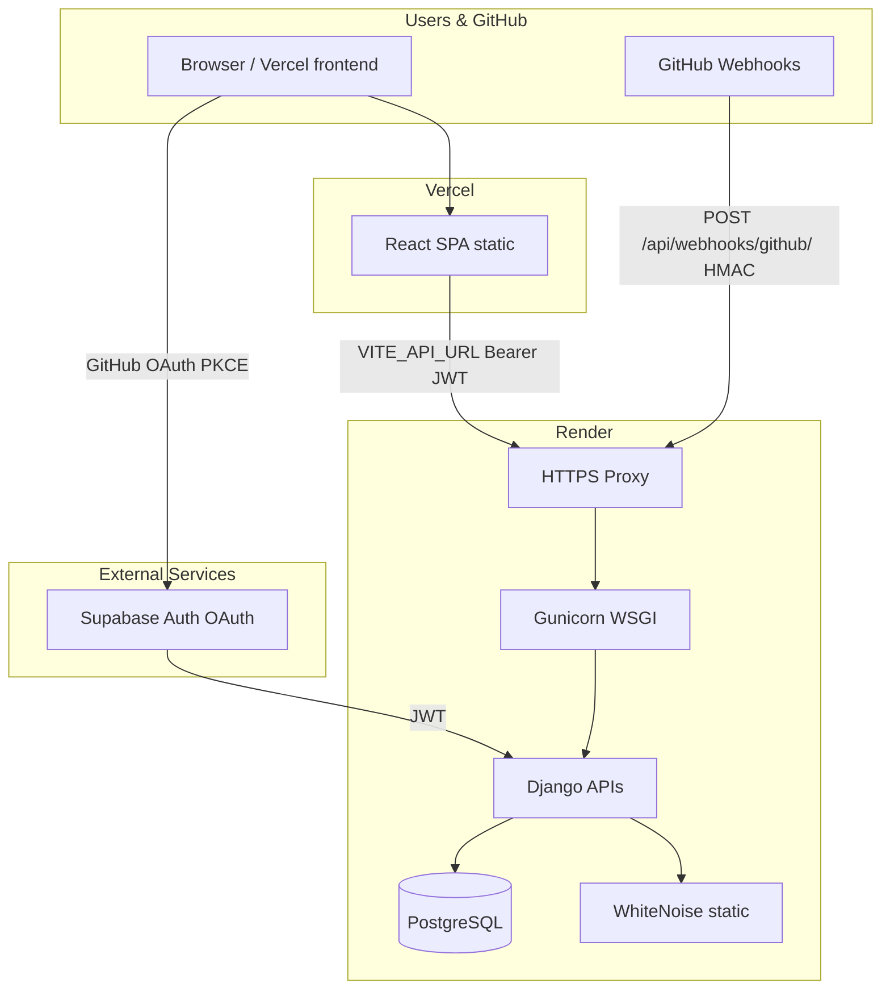

# CommitIQ Production Deployment Guide

Is document mein sab kuch hai — Gunicorn/Nginx kya hai, kyun choose kiya, code mein kya change hua, aur deploy kaise karna hai.

---

## Part 1 — `runserver` vs Production Server

### Local (development)

```bash
python manage.py runserver
```

- Sirf development ke liye hai
- Django docs khud kehte hain: production pe mat use karo
- Ek process, weak concurrency, no real security hardening
- Crash = poora server down

### Production

Internet se aane wali requests ko handle karne ke liye **WSGI server** chahiye.

```
Internet (browser, GitHub webhooks)
        ↓
   Gunicorn          ← production HTTP server
        ↓
   Django (views, APIs, middleware)
        ↓
   PostgreSQL
```

---

## Part 2 — Gunicorn kya hai?

**Gunicorn** = **Gu**icorn **N**etwork (Green Unicorn)

Python **WSGI HTTP server** — Django aur internet ke beech ka middleman.

### WSGI kya hai?

**W**eb **S**erver **G**ateway **I**nterface — Python web frameworks (Django, Flask) aur servers ke beech ka standard contract. Gunicorn WSGI follow karta hai, isliye Django ke saath seedha kaam karta hai.

### Gunicorn kya karta hai?

| Kaam | Detail |
|------|--------|
| HTTP requests accept | Port pe sunta hai (`$PORT` on Render) |
| Django ko forward | `core.wsgi:application` call karta hai |
| Multiple workers | Parallel processes — ek busy ho to doosra request le |
| Response return | Client ko HTTP response bhejta hai |
| Crash isolation | Ek worker crash → baaki chalte rahen |

### Simple analogy

- **Django** = kitchen (logic, APIs, database)
- **Gunicorn** = waiter (requests leke kitchen ko deta hai, response wapas)

---

## Part 3 — Nginx kya hai? Kyun use nahi kiya?

**Nginx** = alag type ka server — **reverse proxy** + **static file server**.

```
Internet
    ↓
  Nginx       ← pehle yahan request aati hai
    ↓
  Gunicorn
    ↓
  Django
```

### Nginx vs Gunicorn

| Kaam | Nginx | Gunicorn |
|------|-------|----------|
| Static files (CSS, images) | Bahut fast | Kar sakta hai, ideal nahi |
| SSL/HTTPS terminate | Haan | Nahi (proxy ke peeche rehta hai) |
| Load balancing | Haan | Nahi |
| Rate limiting | Haan | Limited |
| Python/Django run karna | **Nahi** | **Haan** |

### CommitIQ mein Nginx kyun nahi?

1. **Render already proxy ka kaam karta hai** — HTTPS, routing, health checks. Alag Nginx VM ki zaroorat nahi.
2. **WhiteNoise** static files serve karta hai (Django admin CSS etc.) — Nginx optional ho gaya.
3. **Simple deploy** — free tier pe kam moving parts = kam headache.
4. **MVP scale** — APIs + webhooks + React on Vercel. Nginx tab zyada useful jab apna VPS ya bahut zyada traffic ho.

### Kab Nginx + Gunicorn dono use karte hain?

- Apna VPS (DigitalOcean, AWS EC2)
- Lakhs requests / heavy traffic
- Multiple Django apps ek server pe
- Static files CDN se alag optimize karna ho

### CommitIQ ka current production stack

```
Vercel (React frontend — static)
    ↓  API calls (VITE_API_URL)
Render HTTPS proxy
    ↓
Gunicorn (Django run)
    ↓
WhiteNoise (admin static files)
    ↓
PostgreSQL (Render Postgres)
```

---

## Part 4 — WhiteNoise kya hai?

`whitenoise` Django ke static files (admin CSS/JS) **bina Nginx ke** serve karta hai.

```
GET /static/admin/...   → WhiteNoise serve karta hai
GET /api/repos/...      → Django view → Gunicorn response
```

Settings mein:
- `WhiteNoiseMiddleware` — SecurityMiddleware ke baad
- `STATIC_ROOT = backend/staticfiles`
- `collectstatic` build time pe chalta hai (`build.sh`)

---

## Part 5 — Django server options (comparison)

### WSGI servers (sync APIs — CommitIQ abhi yahi use karta hai)

| Server | Pros | Cons |
|--------|------|------|
| **Gunicorn** ✅ | Simple, popular, Render friendly | Sync workers — CPU-heavy pe limit |
| **uWSGI** | Powerful, configurable | Config complex |
| **Waitress** | Pure Python, Windows friendly | Linux prod pe Gunicorn zyada common |
| **mod_wsgi** | Apache ke andar | Purana style, Apache setup |

### ASGI servers (WebSockets, async heavy — abhi zaroorat nahi)

| Server | Use case |
|--------|----------|
| **Uvicorn** | FastAPI, Django Channels |
| **Daphne** | Django Channels official |
| **Hypercorn** | ASGI + HTTP/2 |

CommitIQ mein abhi WebSockets / live AI streaming nahi — **Gunicorn + WSGI sahi choice**.

### Production "best" — scale ke hisaab se

| Stage | Recommended stack |
|-------|-------------------|
| **MVP (abhi)** | Vercel + Render + Gunicorn + WhiteNoise + Postgres ✅ |
| **Growth** | Same + paid Render plan, zyada workers, Cloudflare CDN |
| **Heavy scale** | Nginx/LB → multiple Gunicorn instances → managed DB |
| **Real-time AI** | Uvicorn + ASGI (baad mein) |

---

## Part 6 — Code mein kya change hua (production prep)

### Files changed / added

#### Backend

| File | Kya hua |
|------|---------|
| `backend/core/settings.py` | Production settings (neeche detail) |
| `backend/core/urls.py` | Naya endpoint: `GET /api/health/` |
| `backend/users/middlewares.py` | `/api/health/` JWT exempt |
| `backend/requirements.txt` | `gunicorn` + `whitenoise` add |
| `backend/.env.example` | Production env var examples |
| `backend/Procfile` | **Nayi** — Gunicorn start command |
| `backend/build.sh` | **Nayi** — migrate + collectstatic |
| `backend/render.yaml` | **Nayi** — Render blueprint |

#### Frontend

| File | Kya hua |
|------|---------|
| `frontend/vercel.json` | **Nayi** — SPA routing (refresh pe 404 fix) |
| `frontend/.env.example` | Production `VITE_API_URL` example |

#### Root

| File | Kya hua |
|------|---------|
| `.gitignore` | `staticfiles/` ignore |

### `settings.py` — logic changes

**1. SECURE_PROXY_SSL_HEADER — ab hamesha ON (pehle sirf DEBUG pe tha)**

```python
SECURE_PROXY_SSL_HEADER = ('HTTP_X_FORWARDED_PROTO', 'https')
```

Render HTTPS proxy pe terminate karta hai. Iske bina admin login / CSRF cookies production pe fail ho sakte hain.

**2. WhiteNoise + static files**

```python
MIDDLEWARE = [
    ...
    'whitenoise.middleware.WhiteNoiseMiddleware',
    ...
]
STATIC_ROOT = BASE_DIR / 'staticfiles'
STATICFILES_STORAGE = 'whitenoise.storage.CompressedManifestStaticFilesStorage'
```

**3. CORS ab `.env` se aata hai (pehle hardcoded localhost tha)**

```python
_cors_origins = os.getenv(
    'CORS_ALLOWED_ORIGINS',
    'http://localhost:5173,http://localhost:3000',
)
CORS_ALLOWED_ORIGINS = [o.strip() for o in _cors_origins.split(',') if o.strip()]
```

Production pe Vercel URL yahan set karna hai.

**4. Pehle se tha, `.env` se control (unchanged logic)**

- `ALLOWED_HOSTS` — Render domain
- `CSRF_TRUSTED_ORIGINS` — HTTPS origins
- `DEBUG=False` production pe

### Naya URL — health check

```
GET /api/health/  →  {"ok": true}
```

- Render health check ke liye
- JWT exempt (`middlewares.py` → `EXEMPT_ROUTES`)
- Pehle `/api/users/me/` socha tha — wo token maangta, 401 deta

**Existing URLs same hain — koi breaking change nahi:**

- `/api/users/...`
- `/api/repos/...`
- `/api/webhooks/github/`
- `/admin/`

### Gunicorn command (Procfile / render.yaml)

```
gunicorn core.wsgi:application --bind 0.0.0.0:$PORT --workers 2 --timeout 120
```

| Flag | Matlab |
|------|--------|
| `core.wsgi:application` | Django entry point (`core/wsgi.py`) |
| `0.0.0.0:$PORT` | Saare interfaces, Render ka dynamic port |
| `--workers 2` | 2 parallel processes |
| `--timeout 120` | Slow requests (webhook, GitHub API) 120 sec wait |

### `build.sh` — deploy time (start se pehle)

```bash
pip install -r requirements.txt
python manage.py collectstatic --noinput
python manage.py migrate --noinput
```

### `frontend/vercel.json` — SPA routing

```json
{
  "rewrites": [{ "source": "/(.*)", "destination": "/index.html" }]
}
```

`/dashboard`, `/auth/callback`, `/dashboard/repositories` — direct open ya refresh pe 404 nahi aayega.

### Frontend API URL (unchanged logic)

`frontend/src/api/client.js`:

```javascript
const API_BASE = import.meta.env.VITE_API_URL || 'http://127.0.0.1:8000'
```

Vercel pe `VITE_API_URL=https://your-api.onrender.com` set karna hai.

---

## Part 7 — Deploy architecture diagram



---

## Part 8 — Hosting choice

| Part | Platform | Kyun |
|------|----------|------|
| **Frontend** | [Vercel](https://vercel.com) | Vite + React, free, fast CDN |
| **Backend** | [Render](https://render.com) | Django + Postgres, free tier, Gunicorn friendly |

---

## Part 9 — Deploy steps (manual — abhi karna hai)

### Step 0 — GitHub pe push

```bash
git add .
git commit -m "Add production deployment config"
git push origin main
```

### Step 1 — Backend on Render

1. [dashboard.render.com](https://dashboard.render.com) → **New Web Service** (ya Blueprint se `render.yaml` import)
2. GitHub repo connect
3. Settings:
   - **Root Directory:** `backend`
   - **Build Command:** `bash build.sh`
   - **Start Command:** `gunicorn core.wsgi:application --bind 0.0.0.0:$PORT --workers 2 --timeout 120`
4. **PostgreSQL** database add karo (free) → `DATABASE_URL` link karo
5. Environment variables set karo:

| Variable | Value |
|----------|-------|
| `DEBUG` | `False` |
| `SECRET_KEY` | long random string |
| `DATABASE_URL` | Render Postgres connection string |
| `SUPABASE_URL` | same as local `backend/.env` |
| `SUPABASE_ANON_KEY` | same |
| `SUPABASE_SERVICE_KEY` | same |
| `GITHUB_WEBHOOK_SECRET` | same |
| `ALLOWED_HOSTS` | `your-app.onrender.com,.onrender.com` |
| `CSRF_TRUSTED_ORIGINS` | `https://your-app.onrender.com` |
| `CORS_ALLOWED_ORIGINS` | Step 2 ke baad Vercel URL add karo |

6. Deploy → API URL note karo: `https://your-app.onrender.com`
7. Test: `https://your-app.onrender.com/api/health/` → `{"ok": true}`

### Step 2 — Frontend on Vercel

1. [vercel.com](https://vercel.com) → Import GitHub repo
2. **Root Directory:** `frontend`
3. Environment variables:

| Variable | Value |
|----------|-------|
| `VITE_API_URL` | `https://your-app.onrender.com` (no trailing slash) |
| `VITE_SUPABASE_URL` | same as backend |
| `VITE_SUPABASE_ANON_KEY` | same |

4. Deploy → Vercel URL: `https://your-app.vercel.app`

### Step 3 — Cross-link (dono connect karo)

**Render** → `CORS_ALLOWED_ORIGINS` update:

```
https://your-app.vercel.app,http://localhost:5173
```

Backend **redeploy** karo.

**Supabase Dashboard** → Authentication → URL Configuration:

- **Site URL:** `https://your-app.vercel.app`
- **Redirect URLs:**
  ```
  https://your-app.vercel.app/auth/callback
  http://localhost:5173/auth/callback
  ```

### Step 4 — GitHub webhooks (production)

Har connected repo → Settings → Webhooks:

| Field | Value |
|-------|-------|
| Payload URL | `https://your-app.onrender.com/api/webhooks/github/` |
| Secret | same `GITHUB_WEBHOOK_SECRET` |
| Content type | `application/json` |

> ngrok ab sirf **local dev** ke liye. Production webhook = Render URL.

### Step 5 — Smoke test checklist

```
[ ] GET /api/health/ → {"ok": true}
[ ] Vercel landing page loads
[ ] Sign in with GitHub → /dashboard
[ ] Repositories load (no "failed to fetch")
[ ] GitHub webhook green tick on new push
[ ] Django admin opens (optional): https://your-app.onrender.com/admin/
```

---

## Part 10 — Environment variables quick reference

### Backend (`backend/.env` local / Render dashboard production)

```env
SECRET_KEY=...
DEBUG=False
DATABASE_URL=postgresql://...

SUPABASE_URL=https://xxx.supabase.co
SUPABASE_ANON_KEY=...
SUPABASE_SERVICE_KEY=...

GITHUB_WEBHOOK_SECRET=...

ALLOWED_HOSTS=your-app.onrender.com,.onrender.com
CSRF_TRUSTED_ORIGINS=https://your-app.onrender.com
CORS_ALLOWED_ORIGINS=https://your-app.vercel.app,http://localhost:5173
```

### Frontend (Vercel dashboard)

```env
VITE_API_URL=https://your-app.onrender.com
VITE_SUPABASE_URL=https://xxx.supabase.co
VITE_SUPABASE_ANON_KEY=...
```

---

## Part 11 — Kya change NAHI hua (important)

- Supabase GitHub OAuth PKCE flow — same
- Webhook HMAC verification (`webhook_utils.py`) — same
- Repo connect/disconnect APIs — same
- JWT middleware logic — same (sirf `/api/health/` exempt add hua)
- Database models — same
- Frontend pages/components — deploy ke liye kuch nahi badla

---

## Part 12 — Common production issues

### "Failed to fetch repositories" (CORS)

Frontend URL backend ke `CORS_ALLOWED_ORIGINS` mein nahi hai.

- Local: `http://localhost:5173` hona chahiye
- Prod: Vercel URL add karo, backend redeploy

### GitHub login redirect fail

Supabase Redirect URLs mein production URL missing:

```
https://your-app.vercel.app/auth/callback
```

### Webhook red X on GitHub

- Payload URL = Render URL (ngrok nahi)
- `GITHUB_WEBHOOK_SECRET` match kare GitHub webhook secret se
- Repo `is_active=True` in Django admin

### Render free tier cold start

Pehli request 30–60 sec slow ho sakti hai (server sleep se wake). Paid plan ya cron ping se fix hota hai.

### Gunicorn workers

Formula (rough): `workers = (2 × CPU cores) + 1`

Free tier pe `--workers 2` theek hai. Traffic badhe to badhao.

---

## Part 13 — Local vs Production summary

| | Local | Production |
|---|-------|------------|
| Django server | `runserver` | Gunicorn |
| Frontend | `npm run dev` :5173 | Vercel static build |
| Database | `.env` DATABASE_URL | Render Postgres |
| HTTPS | http localhost | Render/Vercel HTTPS |
| Webhooks | ngrok tunnel | Render public URL |
| Static files | Django dev | WhiteNoise + collectstatic |
| CORS | localhost:5173 | Vercel URL in env |

---

## Part 14 — Ab kya kaam bacha hai

| Status | Task |
|--------|------|
| ✅ Done | Production code + config files |
| ⬜ Pending | GitHub pe push |
| ⬜ Pending | Render backend deploy |
| ⬜ Pending | Vercel frontend deploy |
| ⬜ Pending | Env vars set (CORS, ALLOWED_HOSTS, etc.) |
| ⬜ Pending | Supabase redirect URLs update |
| ⬜ Pending | GitHub webhook URL → Render |
| ⬜ Pending | End-to-end smoke test |

---

*Last updated: production deploy prep for CommitIQ — Render (backend) + Vercel (frontend).*
