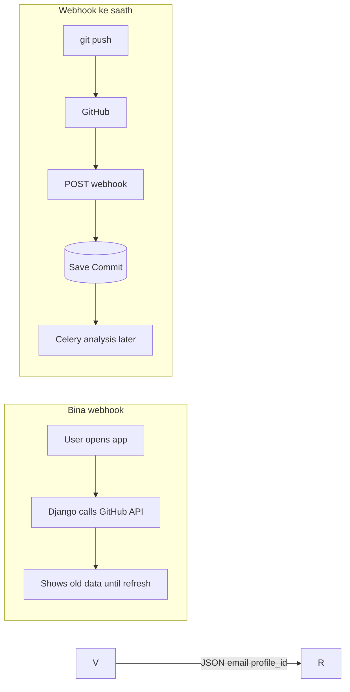

# **LOGIC for WEBHOOK**

Webhook view mein kya logic likhenge?
Yeh fetch nahi — yeh receive + validate + save hai.

## **Step A — Middleware se exempt**

Normal routes pe Authorization: Bearer chahiye.
GitHub token nahi bhejta — apna signature bhejta hai.
Isliye /api/webhooks/github/ ko auth middleware ki exempt list mein daalenge.

## **Step B — Signature verify (security — zaroori)**

Koi random internet se bhi POST kar sakta hai "maine push kiya".
GitHub secret se body sign karta hai:

GitHub: HMAC-SHA256(secret, raw_request_body) → header mein bhejta hai
Tum: same calculation karo → match? → real GitHub : fake reject 401
Bina iske webhook khula darwaza hai.

## **Step C — Event type check**

Header X-GitHub-Event == "push" ?

Haan → aage badho
Nahi (ping, pull_request) → 200 OK return, ignore (ya baad mein support)

GitHub webhook add karte waqt "ping" (GitHub ka ping = ek webhook event ka naam (X-GitHub-Event: ping). Matlab: "maine tumhare URL pe hook lagaya, dekho request aa rahi hai ya nahi.") bhejta hai test ke liye — usko handle karna padta hai.

## **Step D — Payload parse**

Push payload mein roughly:

repository.full_name → "username/repo-name"
commits[] → har commit ka id (sha), message, author, timestamp
ya after (latest sha) — implementation choice

## **Step E — Sirf connected repos**

DB mein Repository dhundho:

full_name match + is_active=True + owner sahi user/repo

Agar connected nahi → 200 OK (GitHub ko error mat do warna retry spam)
lekin DB mein save mat karo

CommitIQ sirf user ne connect ki hui repos track karega.

## **Step F — Commit save (idempotent)**

Har commit sha ke liye:

Commit.objects.get_or_create(repository=..., sha=...)

duplicate sha → skip (same push dubara aaye to crash nahi)

## **Step G — Fast 200 response**

return JsonResponse({"ok": true}, status=200)

GitHub ko jaldi 200 chahiye; heavy analysis abhi nahi — Week 3 mein Celery queue mein daalenge.

Webhook handler light rakho:

verify → save → 200

