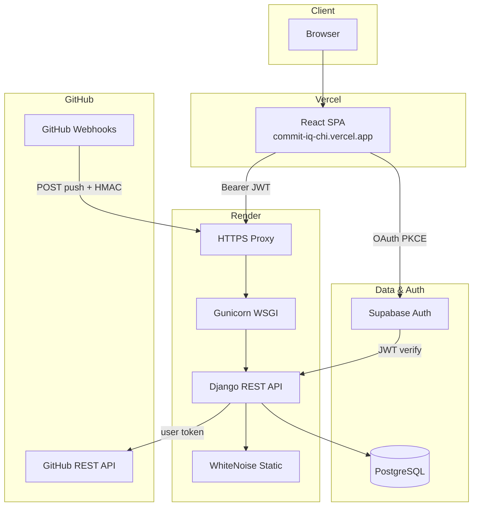
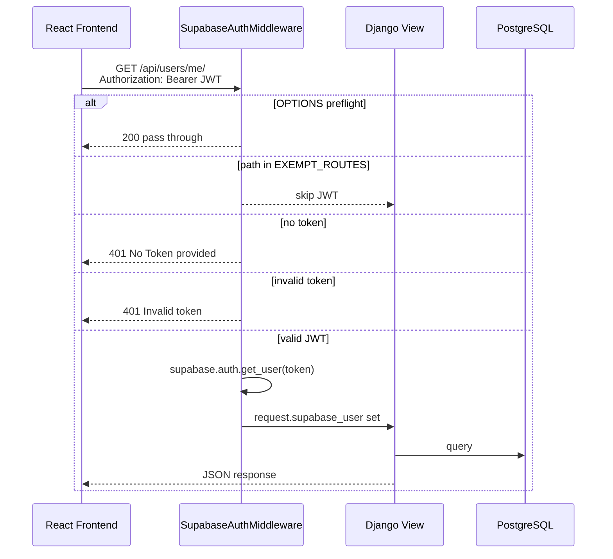
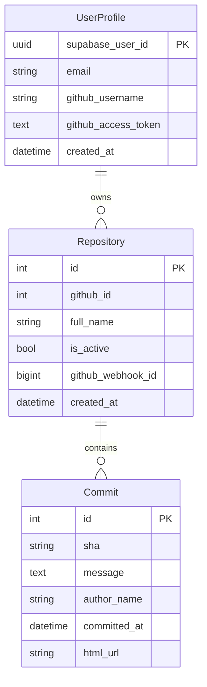
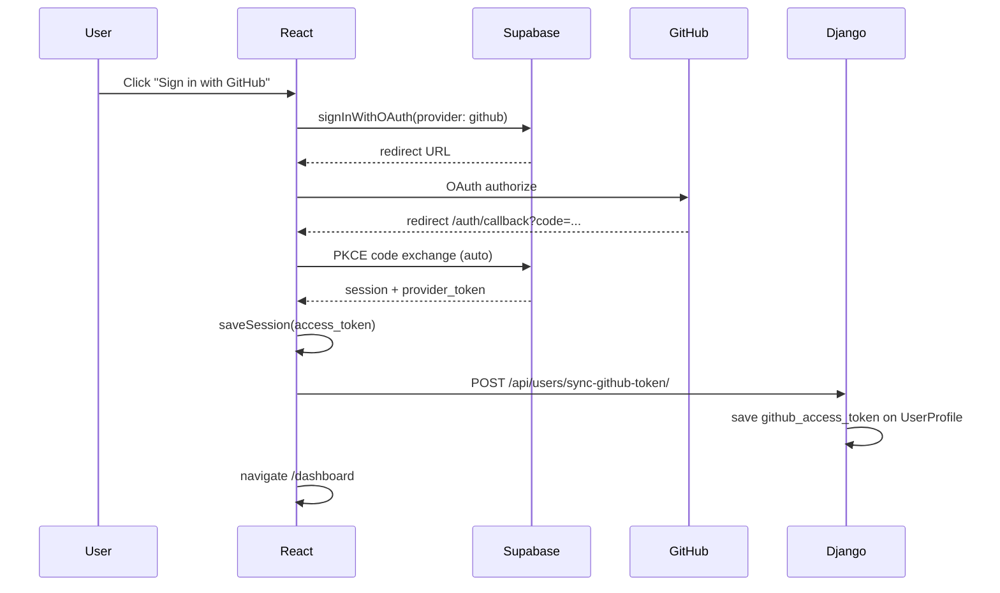
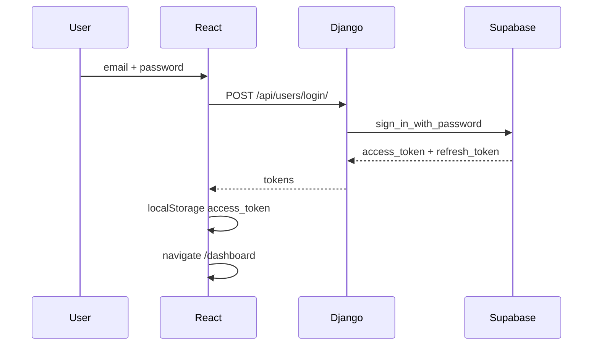
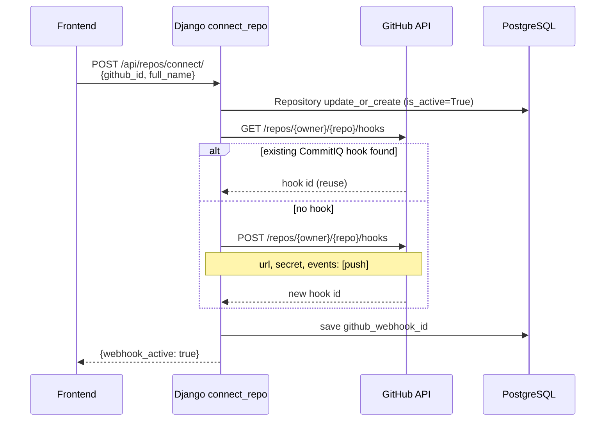
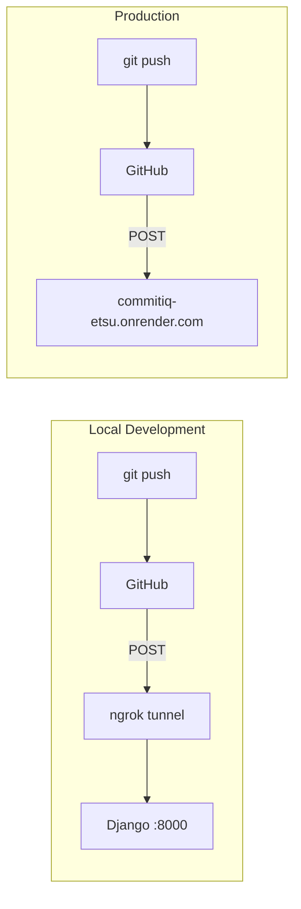
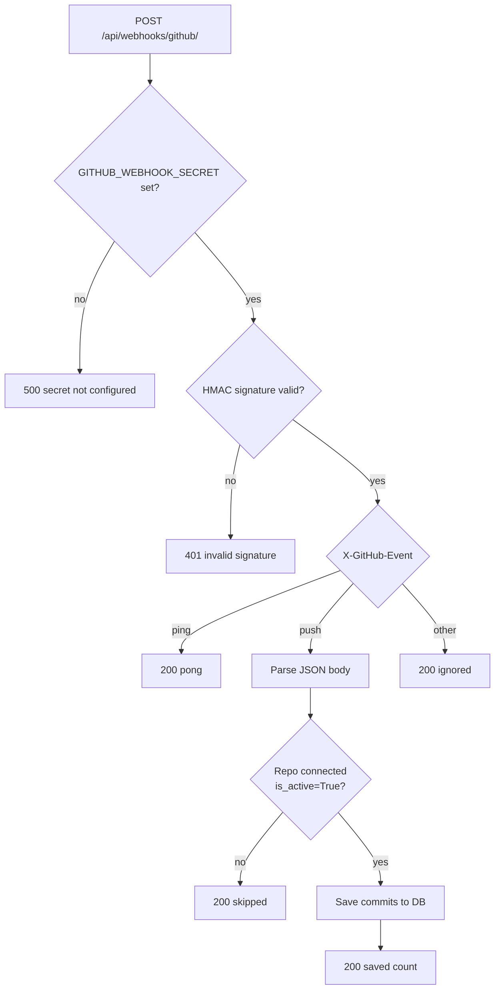
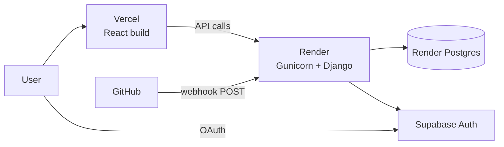

# CommitIQ

**Every commit tells a story. We read it.**

CommitIQ is an AI-powered code regression and performance intelligence platform. It connects to your GitHub repositories, tracks commits in real time via webhooks, and surfaces a developer-focused dashboard for monitoring code health — with analysis, APM correlation, and Ask AI features on the roadmap.

| | |
|---|---|
| **Frontend** | [commit-iq-chi.vercel.app](https://commit-iq-chi.vercel.app) |
| **Backend API** | [commitiq-etsu.onrender.com](https://commitiq-etsu.onrender.com) |
| **Health check** | `GET /api/health/` → `{"ok": true}` |

---

## Table of Contents

- [Features](#features)
- [Tech Stack](#tech-stack)
- [System Architecture](#system-architecture)
- [Project Structure](#project-structure)
- [Data Model](#data-model)
- [Authentication Flows](#authentication-flows)
- [GitHub Integration](#github-integration)
- [Webhook Pipeline](#webhook-pipeline)
- [API Reference](#api-reference)
- [Frontend Routes](#frontend-routes)
- [Local Development](#local-development)
- [Environment Variables](#environment-variables)
- [Deployment](#deployment)
- [Security Model](#security-model)
- [Current State & Roadmap](#current-state--roadmap)
- [Further Reading](#further-reading)

---

## Features

### Implemented

- **Landing page** — DevTrack-inspired dark UI with violet accent, hero, feature cards, stats
- **Authentication** — Email/password via Supabase + GitHub OAuth (PKCE)
- **Dashboard** — Stats, connected repos, recent commits, performance graph (mock data for analysis)
- **Repositories** — List GitHub repos, connect/disconnect, view commits, auto webhook registration
- **GitHub webhooks** — Push events saved to PostgreSQL with HMAC signature verification
- **Commit tracking** — Commits synced from GitHub API and webhook payloads
- **Production deploy** — Vercel (frontend) + Render (backend) + Supabase + PostgreSQL

### Mock / Coming Soon

- Static analysis results (N+1 detection, complexity) — UI built, backend pending
- APM correlation (Datadog / New Relic)
- Ask AI (RAG pipeline over codebase)
- Smart alerts (Slack / email)

---

## Tech Stack

| Layer | Technology |
|-------|------------|
| **Frontend** | React 19, Vite 8, React Router 7, Tailwind CSS v4 |
| **Charts & Icons** | Recharts, Lucide React |
| **Backend** | Django 6, Django REST Framework |
| **Auth** | Supabase Auth (JWT) |
| **Database** | PostgreSQL |
| **GitHub** | REST API + Webhooks |
| **Production server** | Gunicorn + WhiteNoise |
| **Hosting** | Vercel (frontend), Render (backend) |

---

## System Architecture

High-level view of how all services connect in production:



### Request path (authenticated API call)



---

## Project Structure

```
CommitIQ/
├── frontend/                    # React + Vite SPA
│   ├── src/
│   │   ├── api/client.js        # Fetch wrapper with JWT interceptor
│   │   ├── components/          # FoxLogo, RiskBadge, PerformanceGraph, etc.
│   │   ├── data/mock.js         # Mock analysis data (until backend ready)
│   │   ├── lib/supabaseClient.js
│   │   ├── pages/               # Landing, Dashboard, Repositories, AskAI, …
│   │   └── utils/               # auth, greeting, riskColor, time, github
│   ├── vercel.json              # SPA rewrites for React Router
│   └── vite.config.js
│
├── backend/                     # Django REST API
│   ├── core/
│   │   ├── settings.py          # Env-based config, CORS, static files
│   │   ├── urls.py              # Root URL routing
│   │   └── wsgi.py
│   ├── users/
│   │   ├── middlewares.py       # Supabase JWT gatekeeper
│   │   ├── views.py             # signup, login, me, sync-github-token
│   │   └── urls.py
│   ├── repos/
│   │   ├── models.py            # UserProfile, Repository, Commit
│   │   ├── views.py             # repos, connect, disconnect, commits
│   │   ├── webhook_views.py     # Receive GitHub push events
│   │   ├── webhook_github.py    # Register/delete hooks via GitHub API
│   │   ├── webhook_utils.py     # HMAC-SHA256 verification
│   │   └── github_client.py     # GitHub REST helper
│   ├── build.sh                 # Render build: install, migrate, collectstatic
│   ├── Procfile                 # Gunicorn start command
│   └── render.yaml              # Render blueprint
│
└── Diagrams and Concepts/       # Deep-dive docs (webhooks, ngrok, production, …)
```

---

## Data Model



| Model | Purpose |
|-------|---------|
| **UserProfile** | Bridges Supabase auth user to app data; stores GitHub OAuth token |
| **Repository** | A GitHub repo the user connected (`is_active=True`); stores webhook id |
| **Commit** | Commit SHA + metadata synced from GitHub API or webhook push payload |

---

## Authentication Flows

CommitIQ supports two login paths. Both result in a Supabase JWT stored in `localStorage` as `access_token`.

### Flow A — GitHub OAuth (recommended for repo access)

Used for listing repos, connecting webhooks, and syncing commits. Requires `admin:repo_hook` scope for auto webhook registration.



**Important:** Do not call `exchangeCodeForSession` manually in `AuthCallback` — the Supabase client already exchanges the PKCE code once. Calling it twice causes `PKCE code verifier not found`.

### Flow B — Email / Password



Email login does **not** include a GitHub API token. The Repositories page will prompt the user to sign in with GitHub for repo features.

### Middleware JWT check

All `/api/*` routes (except exempt list) require:

```
Authorization: Bearer <supabase_access_token>
```

Non-API paths like `/admin/` bypass JWT checks entirely.

---

## GitHub Integration

### Connect a repository

When a user clicks **Connect** on the Repositories page:



If webhook setup fails, the repo is still connected in the DB but `webhook_active` is `false`. Use **Setup webhook** (retry endpoint) or Disconnect → Connect again.

### Disconnect

`POST /api/repos/disconnect/` sets `is_active=False`, deletes the GitHub hook, and clears `github_webhook_id`.

### List commits

`GET /api/repos/{id}/commits/` fetches recent commits from GitHub REST API, upserts into DB, and returns cached results.

---

## Webhook Pipeline

GitHub calls **our server** on every push — not the other way around. This is why webhooks need a public URL (Render in production, ngrok in local dev).



### Webhook receive flow (`github_webhook` view)



**Security:** Webhooks do not use Supabase JWT. Authentication is `X-Hub-Signature-256` HMAC with `GITHUB_WEBHOOK_SECRET`.

**Payload parsing:** Supports both `application/json` and `application/x-www-form-urlencoded` (GitHub can send either).

---

## API Reference

Base URL: `http://127.0.0.1:8000` (local) or `https://commitiq-etsu.onrender.com` (production)

### Health

| Method | Path | Auth | Description |
|--------|------|------|-------------|
| `GET` | `/api/health/` | None | Liveness check |

### Users (`/api/users/`)

| Method | Path | Auth | Description |
|--------|------|------|-------------|
| `POST` | `/signup/` | None | Register with email/password |
| `POST` | `/login/` | None | Login, returns JWT |
| `POST` | `/logout/` | Bearer | Logout |
| `GET` | `/me/` | Bearer | Current user + profile |
| `POST` | `/sync-github-token/` | Bearer | Save GitHub provider token from Supabase session |
| `GET` | `/github-login/` | None | OAuth URL (backend path, unused by current frontend) |
| `POST` | `/callback/` | None | Code exchange (backend path, unused by current frontend) |

### Repositories (`/api/repos/`)

| Method | Path | Auth | Description |
|--------|------|------|-------------|
| `GET` | `/github/` | Bearer + GitHub token | List user's GitHub repos |
| `GET` | `/connected/` | Bearer | List connected repos |
| `POST` | `/connect/` | Bearer + GitHub token | Connect repo + register webhook |
| `POST` | `/disconnect/` | Bearer + GitHub token | Disconnect + delete webhook |
| `POST` | `/retry-webhook/` | Bearer + GitHub token | Retry webhook for connected repo |
| `GET` | `/{repo_id}/commits/` | Bearer + GitHub token | List/sync commits |

### Webhooks

| Method | Path | Auth | Description |
|--------|------|------|-------------|
| `POST` | `/api/webhooks/github/` | HMAC signature | GitHub push/ping events |

---

## Frontend Routes

| Path | Page | Protected |
|------|------|-----------|
| `/` | Landing | No |
| `/login` | Login | Guest only |
| `/signup` | Signup | Guest only |
| `/auth/callback` | GitHub OAuth callback | No |
| `/dashboard` | Dashboard overview | Yes |
| `/dashboard/repositories` | Connect & manage repos | Yes |
| `/dashboard/commits/:id` | Commit detail (mock analysis) | Yes |
| `/dashboard/ask` | Ask AI chat (mock) | Yes |

Protected routes redirect to `/` when `localStorage.access_token` is missing.

---

## Local Development

### Prerequisites

- Node.js 18+
- Python 3.12+
- PostgreSQL database
- Supabase project (Auth + GitHub provider enabled)
- GitHub account

### 1. Clone and configure

```bash
git clone https://github.com/coutKaustubh/CommitIQ.git
cd CommitIQ
```

Copy environment files:

```bash
cp backend/.env.example backend/.env
cp frontend/.env.example frontend/.env
```

Fill in `backend/.env` and `frontend/.env` with your Supabase credentials and `DATABASE_URL`.

### 2. Backend

```bash
cd backend
python -m venv venv

# Windows
venv\Scripts\activate
# macOS/Linux
source venv/bin/activate

pip install -r requirements.txt
python manage.py migrate
python manage.py runserver
```

API runs at `http://127.0.0.1:8000`.

### 3. Frontend

```bash
cd frontend
npm install
npm run dev
```

App runs at `http://localhost:5173` (strict port — see `vite.config.js`).

### 4. Supabase redirect URLs

Add to Supabase Dashboard → Authentication → URL Configuration:

```
http://localhost:5173/auth/callback
https://commit-iq-chi.vercel.app/auth/callback
```

### 5. Local webhooks (optional)

GitHub cannot reach `localhost`. Use ngrok for webhook testing:

```bash
ngrok http 8000
```

Update `PUBLIC_API_URL`, `ALLOWED_HOSTS`, and `CSRF_TRUSTED_ORIGINS` in `backend/.env` with your ngrok URL. See [`Diagrams and Concepts/ngrok.md`](Diagrams%20and%20Concepts/ngrok.md).

---

## Environment Variables

### Backend (`backend/.env`)

| Variable | Required | Description |
|----------|----------|-------------|
| `SECRET_KEY` | Yes | Django secret key |
| `DEBUG` | Yes | `True` local, `False` production |
| `DATABASE_URL` | Yes | PostgreSQL connection string |
| `SUPABASE_URL` | Yes | Supabase project URL |
| `SUPABASE_ANON_KEY` | Yes | Supabase anon key |
| `SUPABASE_SERVICE_KEY` | Yes | Supabase service role key (middleware JWT verify) |
| `GITHUB_WEBHOOK_SECRET` | Yes | Shared secret for webhook HMAC |
| `PUBLIC_API_URL` | Yes | Public backend URL for webhook registration |
| `ALLOWED_HOSTS` | Yes | Comma-separated allowed hostnames |
| `CSRF_TRUSTED_ORIGINS` | Yes | HTTPS origins for Django admin CSRF |
| `CORS_ALLOWED_ORIGINS` | Yes | Frontend origins allowed by CORS |

### Frontend (`frontend/.env` / Vercel)

| Variable | Required | Description |
|----------|----------|-------------|
| `VITE_API_URL` | Yes | Backend base URL (no trailing slash) |
| `VITE_SUPABASE_URL` | Yes | Same Supabase project |
| `VITE_SUPABASE_ANON_KEY` | Yes | Supabase anon key |

**Note:** Vite embeds `VITE_*` vars at build time. Set them in the Vercel dashboard for production deploys.

---

## Deployment

### Production URLs

| Service | URL |
|---------|-----|
| Frontend | https://commit-iq-chi.vercel.app |
| Backend | https://commitiq-etsu.onrender.com |

### Architecture (production)



### Backend — Render

1. Connect GitHub repo, set **Root Directory** to `backend`
2. **Build command:** `bash build.sh`
3. **Start command:** `gunicorn core.wsgi:application --bind 0.0.0.0:$PORT --workers 2 --timeout 120`
4. Add PostgreSQL database, link `DATABASE_URL`
5. Set all backend env vars (see above)
6. Verify: `GET https://commitiq-etsu.onrender.com/api/health/`

Or import `backend/render.yaml` as a Render Blueprint.

### Frontend — Vercel

1. Import repo, set **Root Directory** to `frontend`
2. Framework: Vite
3. Environment variables:
   ```
   VITE_API_URL=https://commitiq-etsu.onrender.com
   VITE_SUPABASE_URL=...
   VITE_SUPABASE_ANON_KEY=...
   ```
4. Deploy

### Post-deploy checklist

```
[ ] PUBLIC_API_URL set on Render
[ ] CORS_ALLOWED_ORIGINS includes Vercel URL
[ ] Supabase redirect URLs include Vercel /auth/callback
[ ] GitHub OAuth scopes include admin:repo_hook
[ ] /api/health/ returns {"ok": true}
[ ] Sign in with GitHub works on production
[ ] Connect repo → Webhook active
[ ] git push → commit appears in DB
```

Full deployment guide: [`Diagrams and Concepts/production.md`](Diagrams%20and%20Concepts/production.md)

---

## Security Model

| Concern | Implementation |
|---------|----------------|
| **API authentication** | Supabase JWT verified on every `/api/*` request via middleware |
| **Webhook authentication** | HMAC-SHA256 (`X-Hub-Signature-256`) with shared secret |
| **CSRF** | Exempt for webhook endpoint; trusted origins for admin |
| **CORS** | Explicit allowlist via `CORS_ALLOWED_ORIGINS` |
| **GitHub token storage** | `UserProfile.github_access_token` in PostgreSQL (server-side only) |
| **Secrets** | `.env` files gitignored; set in Render/Vercel dashboards |
| **HTTPS** | Enforced in production via Render/Vercel TLS termination |

### Middleware exempt routes (no JWT required)

- `/api/health/`
- `/api/users/signup/`, `/login/`, `/github-login/`, `/callback/`
- `/api/webhooks/github/`

---

## Current State & Roadmap

### Done

- [x] Supabase auth (email + GitHub OAuth PKCE)
- [x] GitHub repo listing, connect, disconnect
- [x] Auto webhook registration on connect
- [x] Webhook receive + HMAC verify + commit persistence
- [x] Full frontend UI (Landing, Dashboard, Repositories, Commit Detail, Ask AI)
- [x] Production deploy (Vercel + Render)
- [x] Gunicorn + WhiteNoise production server

### In Progress / Next

- [ ] Real static analysis pipeline (replace mock data)
- [ ] APM integration (Datadog / New Relic)
- [ ] Ask AI RAG backend
- [ ] Slack / email alerts
- [ ] GitHub App (alternative to per-repo OAuth webhooks)

---

## Further Reading

Detailed concept docs in [`Diagrams and Concepts/`](Diagrams%20and%20Concepts/):

| Document | Topics |
|----------|--------|
| [`production.md`](Diagrams%20and%20Concepts/production.md) | Gunicorn, Nginx, Render/Vercel deploy, env vars |
| [`webhook.md`](Diagrams%20and%20Concepts/webhook.md) | Webhook debugging, signature verification |
| [`ngrok.md`](Diagrams%20and%20Concepts/ngrok.md) | Local webhook testing with ngrok |
| [`ReactFrontendtoDjango.md`](Diagrams%20and%20Concepts/ReactFrontendtoDjango.md) | Frontend ↔ backend request flow |

---

## License

MIT (or specify your license here)

---

## Author

Built by developers, for developers.

**CommitIQ** — *Your code has a pulse.*
