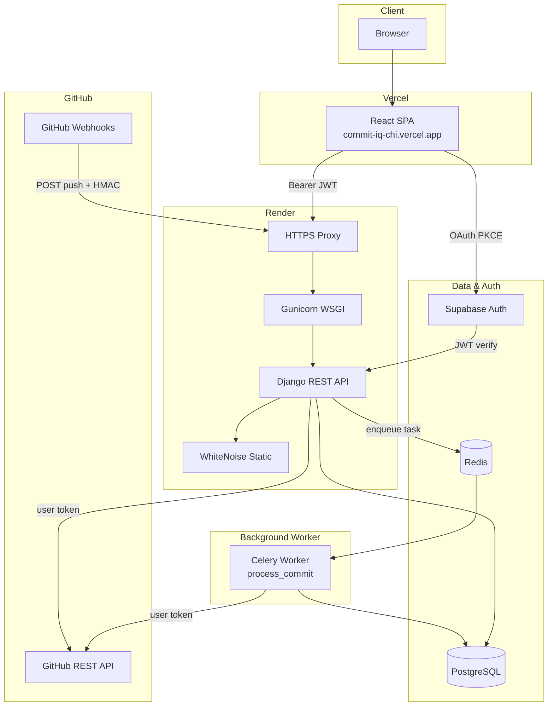
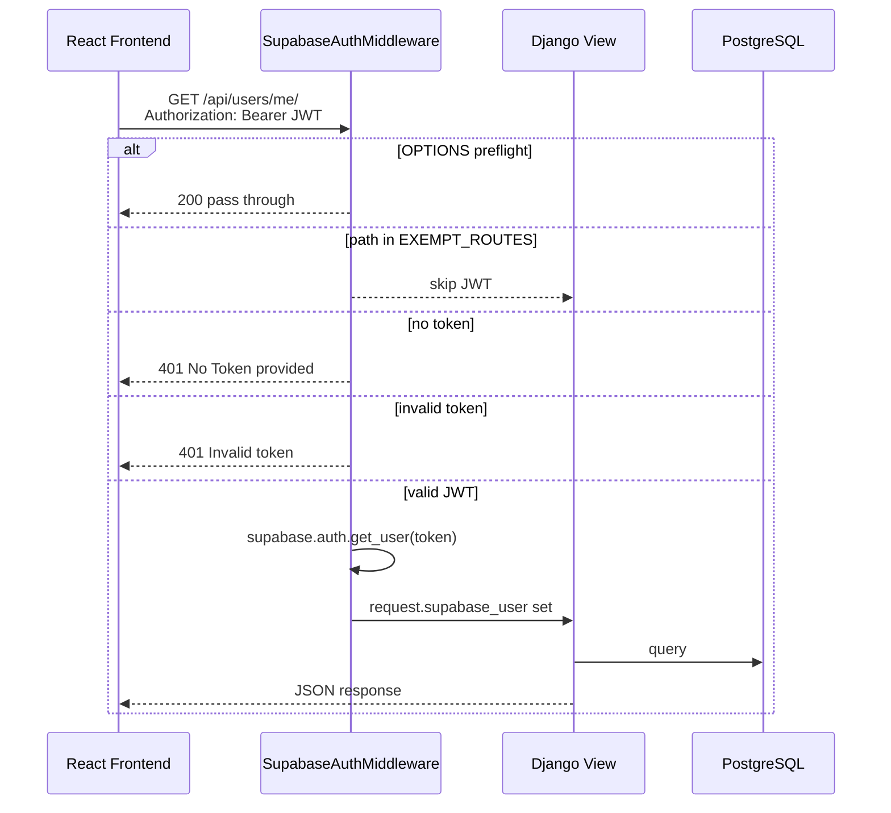
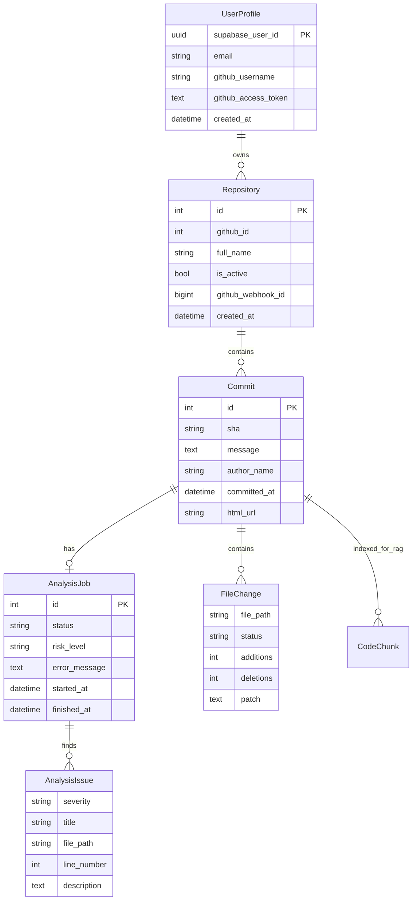
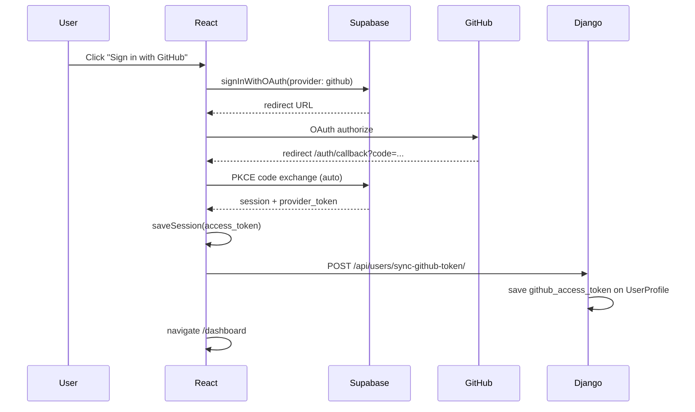
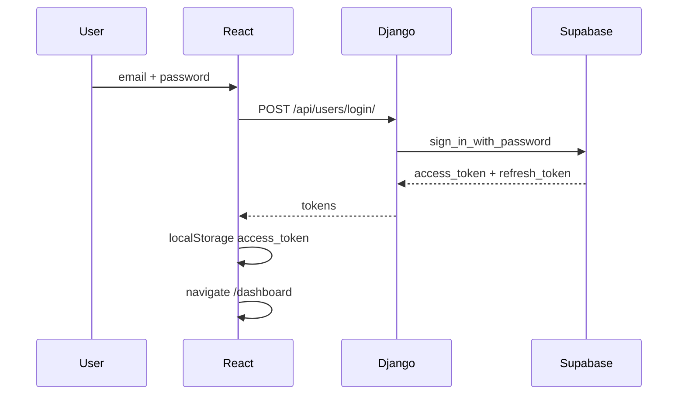
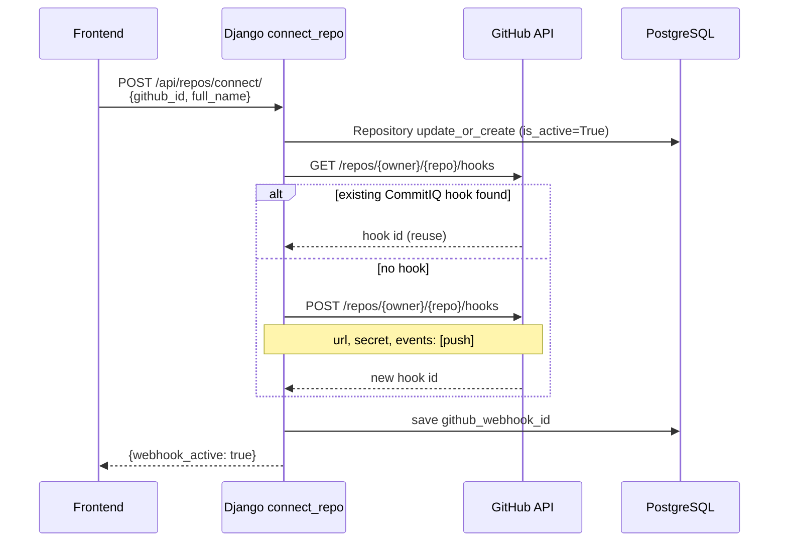
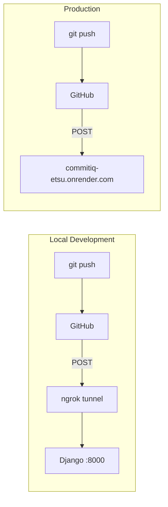
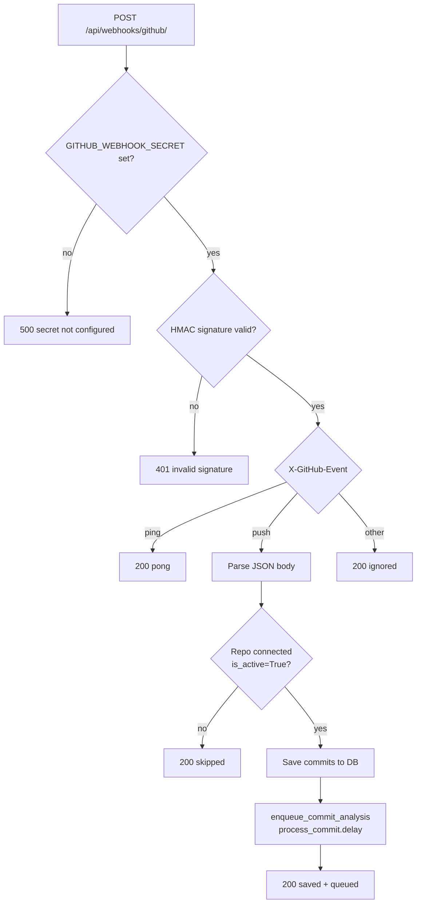
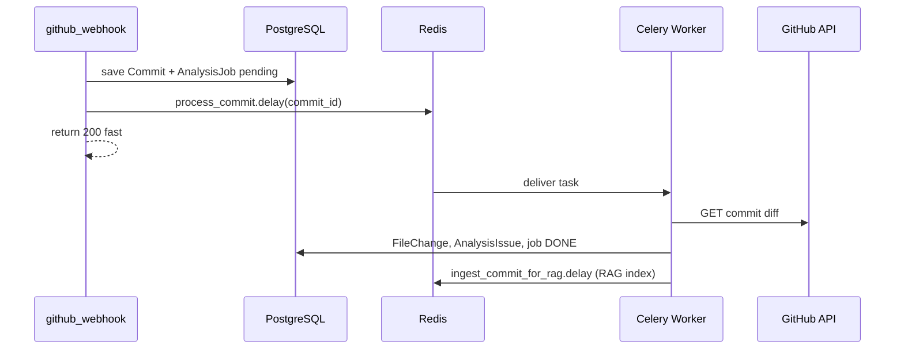
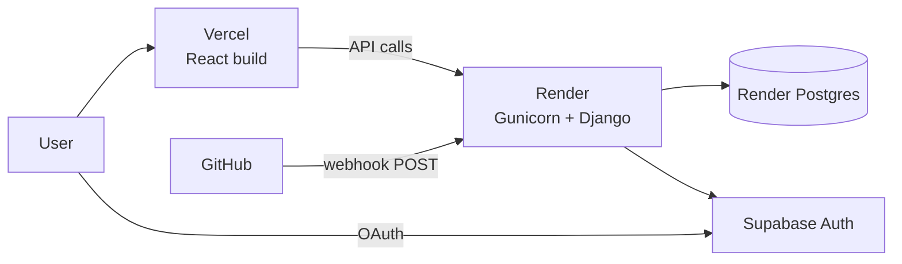

# CommitIQ

**Every commit tells a story. We read it.**

CommitIQ is an AI-powered code regression and performance intelligence platform. It connects to your GitHub repositories, tracks commits in real time via webhooks, runs **background static analysis** (Celery + Redis), surfaces results on a developer-focused dashboard, and includes **Ask AI** — a RAG pipeline over indexed commit diffs and analysis findings (Groq + pgvector).

| | |
|---|---|
| **Frontend** | [commit-iq-chi.vercel.app](https://commit-iq-chi.vercel.app) |
| **Backend API** | [commitiq-etsu.onrender.com](https://commitiq-etsu.onrender.com) |
| **Health check** | `GET /api/health/` → `{"ok": true}` |

---

## Table of Contents

- [Features](#features)
- [Tech Stack](#tech-stack)
- [System Architecture](#system-architecture)
- [Project Structure](#project-structure)
- [Data Model](#data-model)
- [Authentication Flows](#authentication-flows)
- [GitHub Integration](#github-integration)
- [Webhook Pipeline](#webhook-pipeline)
- [API Reference](#api-reference)
- [Frontend Routes](#frontend-routes)
- [Local Development](#local-development)
- [Environment Variables](#environment-variables)
- [Deployment](#deployment)
- [Security Model](#security-model)
- [Current State & Roadmap](#current-state--roadmap)
- [Further Reading](#further-reading)

---

## Features

### Implemented

- **Landing page** — "Ember Fox" dark UI (orange accent), oversized hero with interactive PULSE headline, animated fox scene, floating feature cards, stats, scroll-reveal sections
- **Authentication** — Email/password via Supabase + GitHub OAuth (PKCE)
- **Dashboard** — Stats, connected repos, recent commits, **real analysis feed** (Celery pipeline); performance graph still mock
- **Repositories** — List GitHub repos, connect/disconnect, view commits, auto webhook registration
- **GitHub webhooks** — Push events saved to PostgreSQL; each commit **enqueued for background analysis**
- **Static analysis (Celery)** — Rule-based checks: N+1 (Python + Node), large diffs, sensitive files (multi-stack paths)
- **Commit detail** — Real issues, risk badges, job status polling, retry on failure, **per-commit Ask AI**
- **Ask AI (RAG)** — pgvector chunk index, HuggingFace embeddings, Groq answers with source citations
- **Ask AI UI** — Repo picker → per-repo chat rooms; multiple chat sessions (ChatGPT-style sidebar, `localStorage`)
- **Rate limiting** — DRF throttling via Redis: Ask AI (per user), login/signup (per IP)
- **Commit tracking** — Commits synced from GitHub API and webhook payloads
- **Unified dashboard shell** — Icon-only sidebar (expands on hover) shared across Dashboard, Repositories, Commit Detail, and Ask AI
- **UI polish pass** — Ember Fox palette everywhere, page fade-in transitions, custom scrollbars, ember focus rings, count-up stat numbers, skeleton loaders, toast notifications, copy-to-clipboard feedback, auto-growing chat input, and a pulsing ring on CRITICAL risk badges
- **Local stack** — Docker Compose: PostgreSQL + Redis + Django + Celery worker
- **Production deploy** — Vercel (frontend) + Render (backend web) + Supabase + PostgreSQL

### Mock / Coming Soon

- Performance graph on Dashboard (mock latency series)
- APM correlation (Datadog / New Relic)
- Smart alerts (Slack / email)
- Production Celery worker + Redis (code ready; deploy as separate Render/Railway service + Upstash Redis)
- Chat history in database (today: browser `localStorage` only)
- LLM-powered playbook explanations (current summary is rule-based text)

---

## Tech Stack

| Layer | Technology |
|-------|------------|
| **Frontend** | React 19, Vite 8, React Router 7, Tailwind CSS v4 |
| **Charts & Icons** | Recharts, Lucide React |
| **Backend** | Django 6, Django REST Framework |
| **Auth** | Supabase Auth (JWT) |
| **Database** | PostgreSQL + **pgvector** (RAG embeddings) |
| **Task queue** | Redis (Celery broker + DRF throttle cache) |
| **Background jobs** | Celery worker (`process_commit`, `ingest_commit_for_rag`) |
| **RAG / LLM** | HuggingFace MiniLM embeddings, Groq API |
| **GitHub** | REST API + Webhooks |
| **Production server** | Gunicorn + WhiteNoise |
| **Hosting** | Vercel (frontend), Render (backend web service) |

---

## System Architecture

High-level view of how all services connect in production:



**Note:** On Render today, only the **web** service is deployed by default. For full analysis in production, add a **Redis** instance and a **Celery worker** service (see [Local Development](#local-development) and [Deployment](#deployment)).

### Request path (authenticated API call)



---

## Project Structure

```
CommitIQ/
├── frontend/                    # React + Vite SPA
│   ├── src/
│   │   ├── api/
│   │   │   ├── client.js        # Fetch wrapper with JWT + 429 handling
│   │   │   ├── analysis.js      # Analysis feed, commit detail, job polling
│   │   │   └── rag.js           # Ask AI API helpers
│   │   ├── components/          # FoxLogo, RiskBadge, PerformanceGraph, ask/…
│   │   ├── data/mock.js         # Mock data for performance graph + suggested questions
│   │   ├── lib/supabaseClient.js
│   │   ├── pages/               # Landing, Dashboard, Repositories, CommitDetail, AskRepoPicker, AskRepoChat, …
│   │   └── utils/               # auth, askChatStorage, greeting, riskColor, time, github
│   ├── public/
│   │   ├── logo.png             # Brand fox logo + favicon
│   │   └── favicon.png
│   ├── vercel.json              # SPA rewrites for React Router
│   └── vite.config.js
│
├── backend/                     # Django REST API
│   ├── core/
│   │   ├── settings.py          # Env-based config, CORS, Celery, RAG, throttling, static files
│   │   ├── throttling.py        # Supabase user + IP rate limit classes
│   │   ├── celery.py            # Celery app bootstrap
│   │   ├── urls.py              # Root URL routing
│   │   └── wsgi.py
│   ├── users/
│   │   ├── middlewares.py       # Supabase JWT gatekeeper
│   │   ├── views.py             # signup, login, me, sync-github-token
│   │   └── urls.py
│   ├── repos/
│   │   ├── models.py            # UserProfile, Repository, Commit, AnalysisJob, CodeChunk, …
│   │   ├── views.py             # repos, connect, disconnect, commits
│   │   ├── analysis_views.py    # Analysis APIs + job polling
│   │   ├── analysis_services.py # Diff fetch, static analysis rules
│   │   ├── rag_services.py      # Chunking, embeddings, vector search, Groq
│   │   ├── rag_views.py         # POST …/ask/ endpoints
│   │   ├── tasks.py             # Celery: process_commit, ingest_commit_for_rag
│   │   ├── webhook_views.py     # Receive GitHub push + enqueue analysis
│   │   ├── webhook_github.py    # Register/delete hooks via GitHub API
│   │   ├── webhook_utils.py     # HMAC-SHA256 verification
│   │   └── github_client.py     # GitHub REST helper
│   ├── Dockerfile               # Backend image for Docker Compose
│   ├── build.sh                 # Render build: install, migrate, collectstatic
│   ├── Procfile                 # Gunicorn start command
│   └── render.yaml              # Render blueprint
│
├── docker-compose.yml           # Local: postgres + redis + backend + celery_worker
│
└── Diagrams and Concepts/       # Deep-dive docs (webhooks, celery, docker, …)
```

---

## Data Model



| Model | Purpose |
|-------|---------|
| **UserProfile** | Bridges Supabase auth user to app data; stores GitHub OAuth token |
| **Repository** | A GitHub repo the user connected (`is_active=True`); stores webhook id |
| **Commit** | Commit SHA + metadata synced from GitHub API or webhook push payload |
| **AnalysisJob** | Background analysis state (`pending` → `running` → `done` / `failed`) + risk level |
| **FileChange** | Per-file diff from GitHub commit API (patch, additions, deletions) |
| **AnalysisIssue** | Static analysis findings (N+1, large diff, sensitive file, etc.) |
| **CodeChunk** | RAG text chunk + pgvector embedding (from diff or issue, per commit) |

---

## Authentication Flows

CommitIQ supports two login paths. Both result in a Supabase JWT stored in `localStorage` as `access_token`.

### Flow A — GitHub OAuth (recommended for repo access)

Used for listing repos, connecting webhooks, and syncing commits. Requires `admin:repo_hook` scope for auto webhook registration.



**Important:** Do not call `exchangeCodeForSession` manually in `AuthCallback` — the Supabase client already exchanges the PKCE code once. Calling it twice causes `PKCE code verifier not found`.

### Flow B — Email / Password



Email login does **not** include a GitHub API token. The Repositories page will prompt the user to sign in with GitHub for repo features.

### Middleware JWT check

All `/api/*` routes (except exempt list) require:

```
Authorization: Bearer <supabase_access_token>
```

Non-API paths like `/admin/` bypass JWT checks entirely.

---

## GitHub Integration

### Connect a repository

When a user clicks **Connect** on the Repositories page:



If webhook setup fails, the repo is still connected in the DB but `webhook_active` is `false`. Use **Setup webhook** (retry endpoint) or Disconnect → Connect again.

### Disconnect

`POST /api/repos/disconnect/` sets `is_active=False`, deletes the GitHub hook, and clears `github_webhook_id`.

### List commits

`GET /api/repos/{id}/commits/` fetches recent commits from GitHub REST API, upserts into DB, and returns cached results.

---

## Webhook Pipeline

GitHub calls **our server** on every push — not the other way around. This is why webhooks need a public URL (Render in production, ngrok in local dev).



### Webhook receive flow (`github_webhook` view)



After the webhook returns `200`, a **Celery worker** picks up `process_commit`: fetches the GitHub diff, runs rules, saves `FileChange` / `AnalysisIssue` rows, and marks `AnalysisJob` as `done`.



After analysis completes, a second Celery task chunks diffs/issues, embeds them, and stores `CodeChunk` rows for Ask AI.

**Security:** Webhooks do not use Supabase JWT. Authentication is `X-Hub-Signature-256` HMAC with `GITHUB_WEBHOOK_SECRET`.

**Payload parsing:** Supports both `application/json` and `application/x-www-form-urlencoded` (GitHub can send either).

---

## API Reference

Base URL: `http://127.0.0.1:8000` (local) or `https://commitiq-etsu.onrender.com` (production)

### Health

| Method | Path | Auth | Description |
|--------|------|------|-------------|
| `GET` | `/api/health/` | None | Liveness check |

### Users (`/api/users/`)

| Method | Path | Auth | Description |
|--------|------|------|-------------|
| `POST` | `/signup/` | None | Register with email/password |
| `POST` | `/login/` | None | Login, returns JWT |
| `POST` | `/logout/` | Bearer | Logout |
| `GET` | `/me/` | Bearer | Current user + profile |
| `POST` | `/sync-github-token/` | Bearer | Save GitHub provider token from Supabase session |
| `GET` | `/github-login/` | None | OAuth URL (backend path, unused by current frontend) |
| `POST` | `/callback/` | None | Code exchange (backend path, unused by current frontend) |

### Repositories (`/api/repos/`)

| Method | Path | Auth | Description |
|--------|------|------|-------------|
| `GET` | `/github/` | Bearer + GitHub token | List user's GitHub repos |
| `GET` | `/connected/` | Bearer | List connected repos |
| `POST` | `/connect/` | Bearer + GitHub token | Connect repo + register webhook |
| `POST` | `/disconnect/` | Bearer + GitHub token | Disconnect + delete webhook |
| `POST` | `/retry-webhook/` | Bearer + GitHub token | Retry webhook for connected repo |
| `GET` | `/{repo_id}/commits/` | Bearer + GitHub token | List/sync commits |

### Analysis (`/api/repos/`)

| Method | Path | Auth | Description |
|--------|------|------|-------------|
| `GET` | `/commits/recent-analysis/` | Bearer | Dashboard feed — recent analyzed commits + stats |
| `GET` | `/commits/{sha}/analysis/` | Bearer | Full analysis for one commit (issues, files, job status) |
| `GET` | `/analysis/jobs/{job_id}/` | Bearer | Poll job status (`pending` / `running` / `done` / `failed`) |
| `POST` | `/analysis/retry/` | Bearer | Re-queue failed or stuck analysis |
| `POST` | `/{repo_id}/ask/` | Bearer | RAG question scoped to one repo (rate limited) |
| `POST` | `/commits/{sha}/ask/` | Bearer | RAG question scoped to one commit (rate limited) |

### Webhooks

| Method | Path | Auth | Description |
|--------|------|------|-------------|
| `POST` | `/api/webhooks/github/` | HMAC signature | GitHub push/ping events |

---

## Frontend Routes

| Path | Page | Protected |
|------|------|-----------|
| `/` | Landing | No |
| `/login` | Login | Guest only |
| `/signup` | Signup | Guest only |
| `/auth/callback` | GitHub OAuth callback | No |
| `/dashboard` | Dashboard overview | Yes |
| `/dashboard/repositories` | Connect & manage repos | Yes |
| `/dashboard/commits/:id` | Commit detail (real analysis + per-commit Ask) | Yes |
| `/dashboard/ask` | Ask AI — choose repository | Yes |
| `/dashboard/ask/:repoId` | Ask AI — new chat for that repo | Yes |
| `/dashboard/ask/:repoId/c/:chatId` | Ask AI — resume a saved chat | Yes |

Protected routes redirect to `/` when `localStorage.access_token` is missing.

---

## Local Development

### Prerequisites

- Node.js 18+
- Python 3.12+ (if not using Docker for backend)
- Docker Desktop (recommended — runs Postgres + Redis + Celery worker together)
- Supabase project (Auth + GitHub provider enabled)
- GitHub account

### Option A — Docker Compose (recommended for full analysis)

Runs PostgreSQL, Redis, Django, and Celery worker in one command:

```bash
# From repo root
docker compose up --build
```

Backend API: `http://127.0.0.1:8000`

In a second terminal, run the frontend on the host:

```bash
cd frontend
npm install
npm run dev
```

App: `http://localhost:5173`

Ensure `backend/.env` exists (copy from `.env.example`). Docker Compose overrides `DATABASE_URL` and `CELERY_BROKER_URL` to use the `db` and `redis` services.

Useful commands:

```bash
docker compose exec backend python manage.py migrate
docker compose logs -f celery_worker
```

See [`Diagrams and Concepts/docker.md`](Diagrams%20and%20Concepts/docker.md) and [`Diagrams and Concepts/celery.md`](Diagrams%20and%20Concepts/celery.md).

### Option B — Manual backend (no Celery worker)

Analysis will **not** run in the background unless you also start Redis and a Celery worker separately.

### 1. Clone and configure

```bash
git clone https://github.com/coutKaustubh/CommitIQ.git
cd CommitIQ
```

Copy environment files:

```bash
cp backend/.env.example backend/.env
cp frontend/.env.example frontend/.env
```

Fill in `backend/.env` and `frontend/.env` with your Supabase credentials. For Option B, set `DATABASE_URL` to your PostgreSQL instance.

### 2. Backend (Option B — manual)

```bash
cd backend
python -m venv venv

# Windows
venv\Scripts\activate
# macOS/Linux
source venv/bin/activate

pip install -r requirements.txt
python manage.py migrate
python manage.py runserver
```

API runs at `http://127.0.0.1:8000`.

To run analysis and RAG ingest manually with Option B, also start Redis and:

```bash
celery -A core worker -l info --pool=solo
```

On Windows, use `--pool=solo` (default prefork is unsupported).

**Ask AI / RAG setup:** In Supabase SQL Editor run `CREATE EXTENSION IF NOT EXISTS vector;`. Set `GROQ_API_KEY` in `backend/.env`. Push commits and wait for analysis + RAG ingest to finish before asking questions.

### 3. Frontend

```bash
cd frontend
npm install
npm run dev
```

App runs at `http://localhost:5173` (strict port — see `vite.config.js`).

### 4. Supabase redirect URLs

Add to Supabase Dashboard → Authentication → URL Configuration:

```
http://localhost:5173/auth/callback
https://commit-iq-chi.vercel.app/auth/callback
```

### 5. Local webhooks (optional)

GitHub cannot reach `localhost`. Use ngrok for webhook testing:

```bash
ngrok http 8000
```

Update `PUBLIC_API_URL`, `ALLOWED_HOSTS`, and `CSRF_TRUSTED_ORIGINS` in `backend/.env` with your ngrok URL. See [`Diagrams and Concepts/ngrok.md`](Diagrams%20and%20Concepts/ngrok.md).

---

## Environment Variables

### Backend (`backend/.env`)

| Variable | Required | Description |
|----------|----------|-------------|
| `SECRET_KEY` | Yes | Django secret key |
| `DEBUG` | Yes | `True` local, `False` production |
| `DATABASE_URL` | Yes | PostgreSQL connection string |
| `SUPABASE_URL` | Yes | Supabase project URL |
| `SUPABASE_ANON_KEY` | Yes | Supabase anon key |
| `SUPABASE_SERVICE_KEY` | Yes | Supabase service role key (middleware JWT verify) |
| `GITHUB_WEBHOOK_SECRET` | Yes | Shared secret for webhook HMAC |
| `PUBLIC_API_URL` | Yes | Public backend URL for webhook registration |
| `ALLOWED_HOSTS` | Yes | Comma-separated allowed hostnames |
| `CSRF_TRUSTED_ORIGINS` | Yes | HTTPS origins for Django admin CSRF |
| `CORS_ALLOWED_ORIGINS` | Yes | Frontend origins allowed by CORS |
| `CELERY_BROKER_URL` | Yes* | Redis URL for Celery queue (default `redis://127.0.0.1:6379/0`) |
| `CELERY_RESULT_BACKEND` | No | Redis URL for task results (defaults to broker) |
| `REDIS_CACHE_URL` | No | Redis for DRF rate-limit counters (defaults to broker DB `/1`) |
| `GROQ_API_KEY` | Yes** | Groq API key for Ask AI answers |
| `GROQ_MODEL` | No | LLM model (default `llama-3.3-70b-versatile`) |
| `RAG_EMBEDDING_MODEL` | No | HuggingFace model (default `sentence-transformers/all-MiniLM-L6-v2`) |
| `RAG_TOP_K` | No | Chunks retrieved per question (default `5`) |
| `THROTTLE_ASK_AI` | No | Ask AI limit per user (default `20/hour`) |
| `THROTTLE_AUTH` | No | Login/signup limit per IP (default `5/minute`) |

\* Required for background analysis. Docker Compose sets `redis://redis:6379/0` automatically.  
\*\* Required for Ask AI responses. Embeddings run locally via `sentence-transformers`.

### Frontend (`frontend/.env` / Vercel)

| Variable | Required | Description |
|----------|----------|-------------|
| `VITE_API_URL` | Yes | Backend base URL (no trailing slash) |
| `VITE_SUPABASE_URL` | Yes | Same Supabase project |
| `VITE_SUPABASE_ANON_KEY` | Yes | Supabase anon key |

**Note:** Vite embeds `VITE_*` vars at build time. Set them in the Vercel dashboard for production deploys.

---

## Deployment

### Production URLs

| Service | URL |
|---------|-----|
| Frontend | https://commit-iq-chi.vercel.app |
| Backend | https://commitiq-etsu.onrender.com |

### Architecture (production)



For **full analysis in production**, add:

- **Redis** — e.g. Upstash or Render Redis (`CELERY_BROKER_URL`)
- **Background worker** — separate service running `celery -A core worker -l info --concurrency=2`

Until the worker is deployed, webhooks still save commits but analysis jobs stay `pending` unless you run the stack locally with Docker Compose.

### Backend — Render

1. Connect GitHub repo, set **Root Directory** to `backend`
2. **Build command:** `bash build.sh`
3. **Start command:** `gunicorn core.wsgi:application --bind 0.0.0.0:$PORT --workers 2 --timeout 120`
4. Add PostgreSQL database, link `DATABASE_URL`
5. Set all backend env vars (see above)
6. Verify: `GET https://commitiq-etsu.onrender.com/api/health/`

Or import `backend/render.yaml` as a Render Blueprint.

### Frontend — Vercel

1. Import repo, set **Root Directory** to `frontend`
2. Framework: Vite
3. Environment variables:
   ```
   VITE_API_URL=https://commitiq-etsu.onrender.com
   VITE_SUPABASE_URL=...
   VITE_SUPABASE_ANON_KEY=...
   ```
4. Deploy

### Post-deploy checklist

```
[ ] PUBLIC_API_URL set on Render
[ ] CORS_ALLOWED_ORIGINS includes Vercel URL
[ ] Supabase redirect URLs include Vercel /auth/callback
[ ] GitHub OAuth scopes include admin:repo_hook
[ ] /api/health/ returns {"ok": true}
[ ] Sign in with GitHub works on production
[ ] Connect repo → Webhook active
[ ] git push → commit appears in DB
[ ] (Local) docker compose + celery_worker logs show process_commit
[ ] (Prod) Redis + Celery worker deployed for live analysis
[ ] Supabase `vector` extension enabled for RAG
[ ] GROQ_API_KEY set for Ask AI
```

Full deployment guide: [`Diagrams and Concepts/production.md`](Diagrams%20and%20Concepts/production.md)

---

## Security Model

| Concern | Implementation |
|---------|----------------|
| **API authentication** | Supabase JWT verified on every `/api/*` request via middleware |
| **Webhook authentication** | HMAC-SHA256 (`X-Hub-Signature-256`) with shared secret |
| **CSRF** | Exempt for webhook endpoint; trusted origins for admin |
| **CORS** | Explicit allowlist via `CORS_ALLOWED_ORIGINS` |
| **GitHub token storage** | `UserProfile.github_access_token` in PostgreSQL (server-side only) |
| **Secrets** | `.env` files gitignored; set in Render/Vercel dashboards |
| **Rate limiting** | Redis-backed DRF throttling on Ask AI + login/signup (HTTP 429) |
| **HTTPS** | Enforced in production via Render/Vercel TLS termination |

### Middleware exempt routes (no JWT required)

- `/api/health/`
- `/api/users/signup/`, `/login/`, `/github-login/`, `/callback/`
- `/api/webhooks/github/`

---

## Current State & Roadmap

### Done

- [x] Supabase auth (email + GitHub OAuth PKCE)
- [x] GitHub repo listing, connect, disconnect
- [x] Auto webhook registration on connect
- [x] Webhook receive + HMAC verify + commit persistence
- [x] Celery + Redis background analysis pipeline (local Docker Compose)
- [x] Static analysis rules (N+1 Python/Node, large diff, sensitive files)
- [x] Analysis APIs + Commit Detail polling + retry
- [x] Ask AI RAG pipeline (pgvector, Celery ingest, Groq, repo + commit ask APIs)
- [x] Ask AI UI — repo picker, per-repo chat rooms, multiple sessions (`localStorage`)
- [x] Rate limiting (Ask AI + auth endpoints)
- [x] Full frontend UI (Landing, Dashboard, Repositories, Commit Detail, Ask AI)
- [x] Ember Fox visual redesign + production-grade UI polish (shared sidebar, transitions, micro-interactions)
- [x] Production deploy (Vercel + Render web service)
- [x] Gunicorn + WhiteNoise production server

> **Production analysis note:** The Render web service does **not** run background jobs by default. For live analysis in production you must deploy a **Redis** instance (e.g. Upstash) and a separate **Celery worker** service (`celery -A core worker -l info --concurrency=2`). Without them, webhooks still persist commits but `AnalysisJob` rows stay `pending` until a worker consumes the queue. Locally, `docker compose up` runs Redis + the worker for you.

### In Progress / Next

- [ ] Production Celery worker + Redis deploy
- [ ] Replace performance graph mock with real metrics
- [ ] Persist Ask AI chat history in database
- [ ] APM integration (Datadog / New Relic)
- [ ] Slack / email alerts
- [ ] More language rules (Java, Ruby, Go N+1 patterns)
- [ ] GitHub App (alternative to per-repo OAuth webhooks)

---

## Further Reading

Detailed concept docs in [`Diagrams and Concepts/`](Diagrams%20and%20Concepts/):

| Document | Topics |
|----------|--------|
| [`SYSTEM_WALKTHROUGH.md`](Diagrams%20and%20Concepts/SYSTEM_WALKTHROUGH.md) | End-to-end system flows (Hinglish) |
| [`FILE_TOUR.md`](Diagrams%20and%20Concepts/FILE_TOUR.md) | File-by-file tourist guide |
| [`RAG.md`](Diagrams%20and%20Concepts/RAG.md) | Ask AI ingest, embeddings, vector search, Groq |
| [`celery.md`](Diagrams%20and%20Concepts/celery.md) | Celery + Redis setup and analysis pipeline |
| [`docker.md`](Diagrams%20and%20Concepts/docker.md) | Docker Compose local stack |
| [`production.md`](Diagrams%20and%20Concepts/production.md) | Gunicorn, Render/Vercel deploy, env vars |
| [`webhook.md`](Diagrams%20and%20Concepts/webhook.md) | Webhook debugging, signature verification |
| [`ngrok.md`](Diagrams%20and%20Concepts/ngrok.md) | Local webhook testing with ngrok |
| [`ReactFrontendtoDjango.md`](Diagrams%20and%20Concepts/ReactFrontendtoDjango.md) | Frontend ↔ backend request flow |

---

## License

MIT (or specify your license here)

---

## Author

Built by developers, for developers.

**CommitIQ** — *Your code has a pulse.*
